# Anthony Legg - Studio 4 PDR

[Link To GitHub Repo](https://GitHub.com/BIT-Studio-4/team-project-2021-s2-team-delta)
[Link To Studio 4 Production Website](https://bit-studio-management.herokuapp.com/)

---

## Evidence For Submission

### What are your personal goals and objectives in addition to the course objectives?

Development of communication, leadership and stress-management skills continues to be a major goal. I think that I have improved in this area from last semester, but there is definitely room for more improvement. I need to take let go more and take things much less personally. Working as part of a group is challenging; everyone has their way of doing things, so I need to be more patient and less reactive.

Would like to get more skills and experience in CI and CD, using services such as GitLab's or Azure DevOps to streamline the project from planning through to deployment. Would also like to apply some of the skills learn from the operations engineering paper in future projects. I think docker would have been hugely beneficial to this project, it would have eliminated some of the configuration issues across multiple development environments.

------

###  What has gone well? What are your strengths?

As a team we were able to improve all aspects of the project that we started with. The site has been made more secure, easy for the end user to navigate, consistently styled across all pages, and provides functionality to suit the clients needs. The most important thing is to deliver on the goals of the client; I think that ultimately we delivered on most of these objectives through communicating and working as a team. Every sprint resulted in improvements in the product and the way we worked together.

I think my strengths are honesty, reliability, empathy and self-motivation. 

------

### What could have gone better and how?

The big one getting everyone working together rather than individually. 

------

### What is not clear or is uncertain?

At this point, I don't actually feel unclear about anything. I learned a tonne from this paper and feel like I have developed a heap of new skills and better ways of working.

# Learning Outcome 1

>  Select and apply industry-standard tools and processes to solve non-trivial problems in a team environment.

## 1.1 Contribute to development of new product features

### Front End Development

Mitchell's as the developer, had a lot of work to do to resolve important issues such as security, and development of new features. Some of these changes were complex, and time consuming; So that Mitchell was not overloaded with both front and backend development, I picked up some development tasks such as completing UI changes on new pages for new features so that Mitchell could continue developing other product backlog items that had a higher priority. By doing this I contributed to implementation the client requested changes across the site. 

- [Sprint 2 - #106(sprint-2-student-controller)](https://github.com/BIT-Studio-4/team-project-2021-s2-team-delta/pull/106)

- [Sprint 2 - #109(sprint-2-jetstream-templates)](https://github.com/BIT-Studio-4/team-project-2021-s2-team-delta/pull/109)

- [Sprint 3 - #141(sprint-3-update-homepage)](https://github.com/BIT-Studio-4/team-project-2021-s2-team-delta/pull/141)

- [Sprint 4 - #184(sprint-4-student-update-form)](https://github.com/BIT-Studio-4/team-project-2021-s2-team-delta/pull/184)

- [Sprint 4 - #185(sprint-4-student-status)](https://github.com/BIT-Studio-4/team-project-2021-s2-team-delta/pull/185)

- [Sprint 4 - #196 (sprint-4-student-update-form)](https://github.com/BIT-Studio-4/team-project-2021-s2-team-delta/pull/196)

- [Sprint 4 - #212 (sprint-4-admin-panel-deployment-fixes)](https://github.com/BIT-Studio-4/team-project-2021-s2-team-delta/pull/212)

- [Sprint 5 - #241 (sprint-5-homepage-layout-update)](https://github.com/BIT-Studio-4/team-project-2021-s2-team-delta/pull/241)

- [Sprint 5 - #250 (sprint-5-homepage-layout-update)](https://github.com/BIT-Studio-4/team-project-2021-s2-team-delta/pull/250)

- [Sprint 6 - #269 (sprint-6-layout-bug-fix)](https://github.com/BIT-Studio-4/team-project-2021-s2-team-delta/pull/269)

  
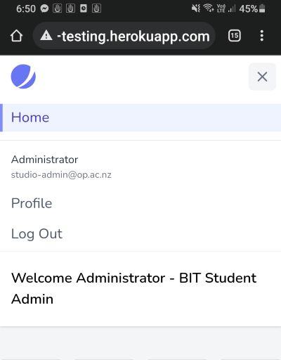

### Final UI Changes

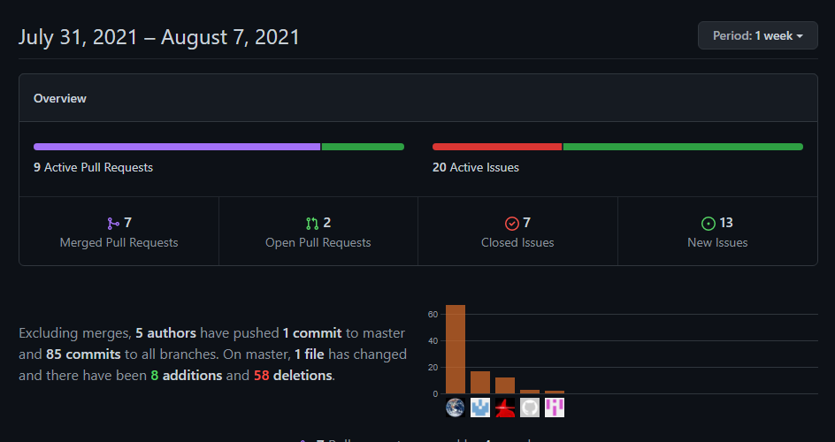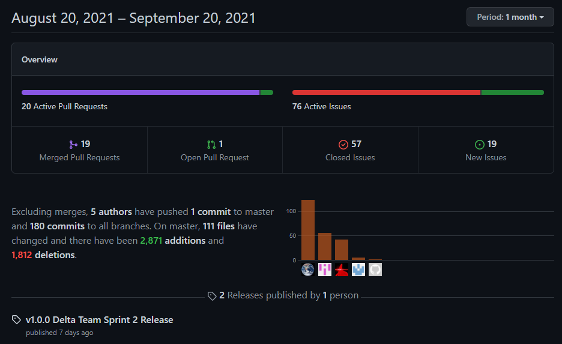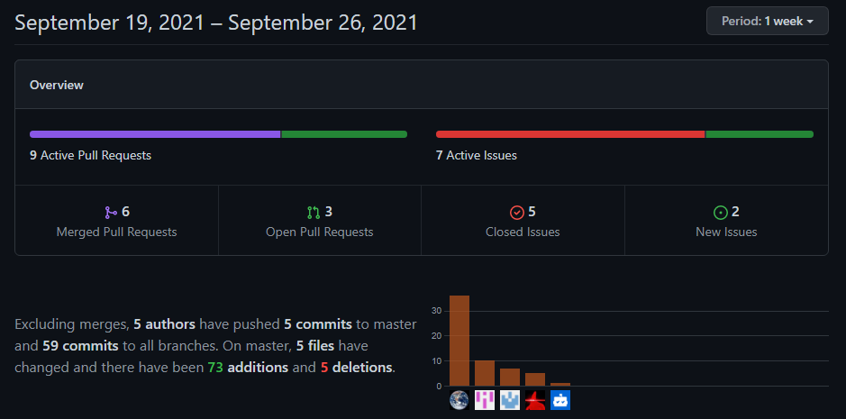

## 1.2 Contribute to Project Deployment

1. Set-Up the pipeline configuration on Heroku, linked this back to the repo at the start of the semester

2. Configured, [tested](https://github.com/BIT-Studio-4/team-project-2021-s2-team-delta/pull/168) [release script](https://github.com/BIT-Studio-4/team-project-2021-s2-team-delta/commits/57bc21c36124b2856e32ad911d42cd9f3e8d4060/scripts/heroku.sh) and [Procfile](https://github.com/BIT-Studio-4/team-project-2021-s2-team-delta/blob/master/Procfile) to run migrations automatically on both Heroku applications. This previously needed to be done manually each time a pull request was merged to the staging and master branches.

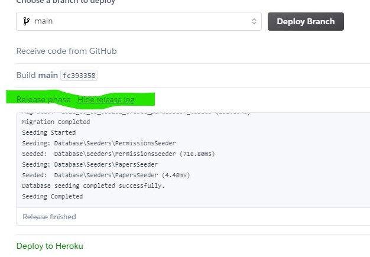

3. During sprint 3, I discovered that Heroku was serving content from a `main` branch, this meant that when we deployed, code was being pushed to a `master` branch and was not getting served; to resolve this I had to merge `master` into the `main` branch, resolve merge conflicts and recompile CSS and JS files locally before pushing back to the Heroku repository.

- [Pull Request #164 - sprint-3-deployment-fix](https://github.com/BIT-Studio-4/team-project-2021-s2-team-delta/pull/164)
- [Pull Request #168 - sprint-3-deployment-fix](https://github.com/BIT-Studio-4/team-project-2021-s2-team-delta/pull/168)

------

## 1.4 Demonstrate Improvements in Applying Agile Project Management

1. At the end of sprint 2, we had run behind schedule, and needed to begin prepartation for sprint 3. We made the mistake of deploying to production, without first getting final signoff. 
	- At this point much stricter [branch rules](https://github.com/BIT-Studio-4/team-project-2021-s2-team-delta/settings/branches) were put in place to avoid this occurring again. 
	- This mistake caused us to think much more critically at our product backlog in the sprint planning stage.
	
2. **<u>Client feedback</u>** During [sprint 3](https://github.com/BIT-Studio-4/team-project-2021-s2-team-delta/milestone/3), the team had a review with the product owner to get feedback on changes in the UI layout and colour scheme. Feedback received was immediately acted on rather than being recorded as a user story, and a action plan for the next sprint.
	
	- this mistake reinforced the need to note the users feedback in the form of user stories
	- plan/propose changes; add to the product backlog, and get further feedback from the client before proceeding with any new feature or change.
	
3. **<u>User stories</u>** As a team we regularly got feedback about our [user stories](https://github.com/BIT-Studio-4/team-project-2021-s2-team-delta/issues/65), their lack of visibility in the product backlog, and the need to keep these relevant. Initially we had our user stories separate from our product backlog items, instead linking these using a [hash tag](https://github.com/BIT-Studio-4/team-project-2021-s2-team-delta/issues/65#issuecomment-894732282). By sprint 3, it became clear doing this made our user stories stale and our product back hard to follow, even for us. At this point all the stale user stories were closed, and the current product backlog updated with current user stories. This immediately [made the point of each item much clearer](https://github.com/BIT-Studio-4/team-project-2021-s2-team-delta/issues/96) and easier to update and get feedback.

4. **<u>Code Reviews</u>** - Sprints 3 & 4 both ran over time. Sprint 4 we took more care in the planning our product backlog and targets for completing allowing enough time at the end to get feedback, and plan for sprint 5. This did not solve the issue, and the sprint still ran over time. One issue that became crystal clear was that the code review process had no definitive end point, and this resulted in some pull requests remaining open and unreviewed for four days in some cases. Despite reminders in class, on teams, during stand up meetings, automated reminders and tagged comments in the pull requests themselves, if the code reviews were not done, nothing would progress. Mitchell more than anyone was negatively affected by this bottleneck, because his changes impacted other backlog items that he needed to move on to, but couldn't until issues were resolved in the PR. 

   To eliminate this issue, and place more urgency on completing reviews I [proposed some rules around code reviews for sprint 5](https://github.com/BIT-Studio-4/team-project-2021-s2-team-delta/discussions/217), trial how this improved our workflow and assess it and the end in the retrospective. The main rule being that pull requests exist for a maximum of 48 hours, if there are no change requests and no test failures the branch would be merged. For the most part, this worked perfectly. Two new issues came up, one was with the test suite failing more often due to the speed of changes, the other with development branches needing updating more often.

   

   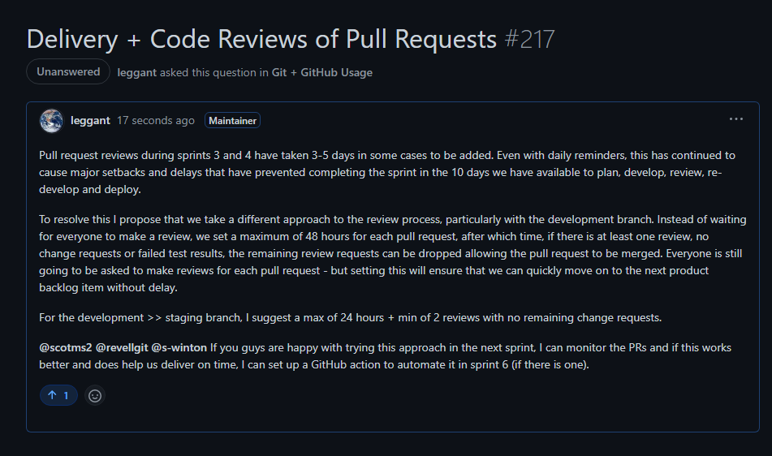

5. [Project Discussion Pages](https://github.com/BIT-Studio-4/team-project-2021-s2-team-delta/discussions) share resources, propose ideas/solutions, sprint plans.

6. **<u>Team Engagement</u>**

   - stand up meetings scheduled at regular times each day; consistency made it easy for everyone to plan for and attend these meetings.

   - From sprint 3, I noticed that everyone on the team was putting more into sprint planning and retrospectives. 

   - In sprint 5, some bad habits started to re-appear, I needed remind everyone to follow the agreed to in the project board. A number of new backlog items were getting added and developed mid-sprint without discussion with the rest of the team, or the product owner. 

     

   
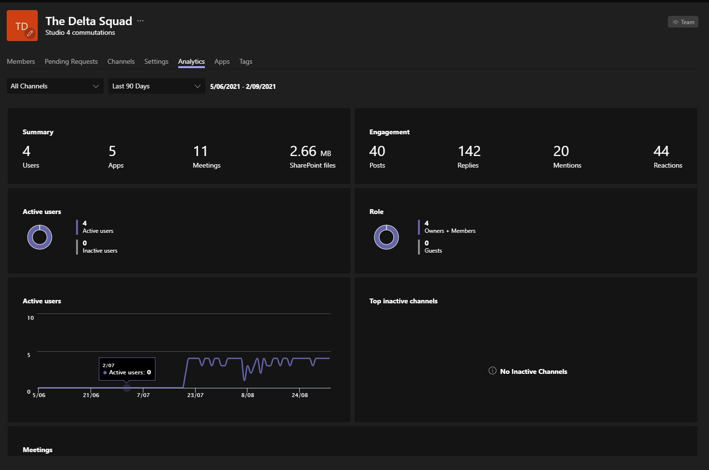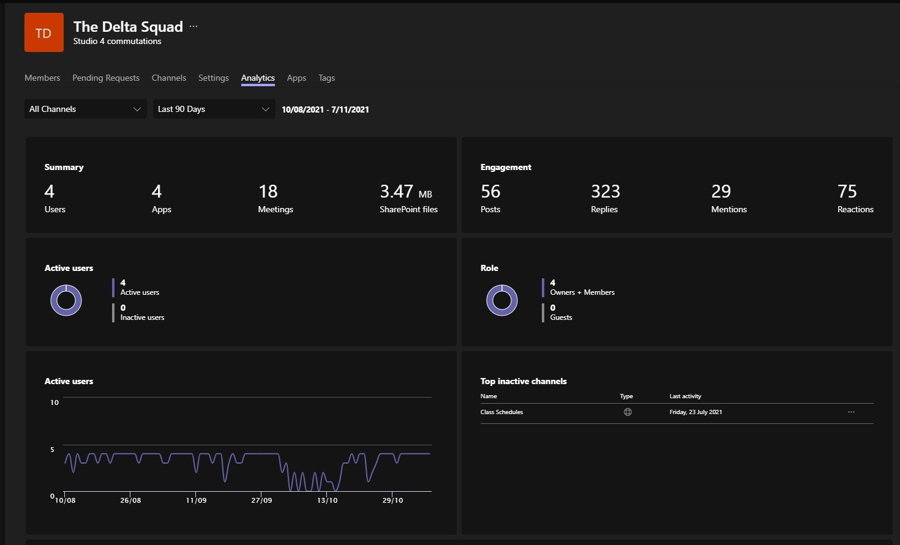

   

------

## 1.5 Use industry-standard communication and project management tools in a professional manner

I cannot say that my communication on Teams was always 100% professional. There were several instances that I had to speak up and be brutally honest, because I could see that there was a casual attitude which was impacting how we were functioning as a team. For instance, our product backlog could be altered at anytime without discussion, that the sprint could be extended beyond two weeks if we were running late, that we could work separately without affecting others, that stand-ups were optional and that code reviews were ok to leave hanging for four days.
1. [Project Release Executive Summaries](https://github.com/BIT-Studio-4/team-project-2021-s2-team-delta/releases)
	- [Sprint 5 Pre-Release](https://github.com/BIT-Studio-4/team-project-2021-s2-team-delta/releases/tag/v1.3.1-beta)
	- [Sprint 4 Pre-Release](https://github.com/BIT-Studio-4/team-project-2021-s2-team-delta/releases/tag/v1.2.1-beta)
	- [Sprint 3 Pre-Release](https://github.com/BIT-Studio-4/team-project-2021-s2-team-delta/releases/tag/v1.1.1-beta)
	
2. [GitHub Discussion Boards](https://github.com/BIT-Studio-4/team-project-2021-s2-team-delta/discussions)
   - [Stand-Up Meeting Summaries](https://github.com/BIT-Studio-4/team-project-2021-s2-team-delta/discussions/136) provided on the teams channel and GH discussion boards during the first half of the semester. I found that attendance at stand-up meetings got a lot more consistent, and that writing these notes had no longer had any impact as no one needed to read them. 
   - [Guides and Resources](https://github.com/BIT-Studio-4/team-project-2021-s2-team-delta/discussions/53)
   - [Security Audit](https://github.com/BIT-Studio-4/team-project-2021-s2-team-delta/discussions/194)
   - [Project Releases](https://github.com/BIT-Studio-4/team-project-2021-s2-team-delta/discussions/286)
   - [Workflow Changes](https://github.com/BIT-Studio-4/team-project-2021-s2-team-delta/discussions/217) seek feedback on proposed changes resulting from sprint retrospectives
   
3. Teams Channel - Stand Up Meetings + Agendas
   - In place of meeting summaries, I found it more useful to set an agenda for our stand-ups in addition to checking in with everyone on how they were tracking, resolving issues, updating the project board.
   
     

     
     
   

4. [Repo Changelog - Project Transparency + Documentation](https://github.com/BIT-Studio-4/team-project-2021-s2-team-delta/blob/master/CHANGELOG.md) Used in project release documentation

5. [Repo Commitlog](https://github.com/BIT-Studio-4/team-project-2021-s2-team-delta/blob/master/COMMITLOG.md)- For QA Reference, Test Maintenance and Development

    

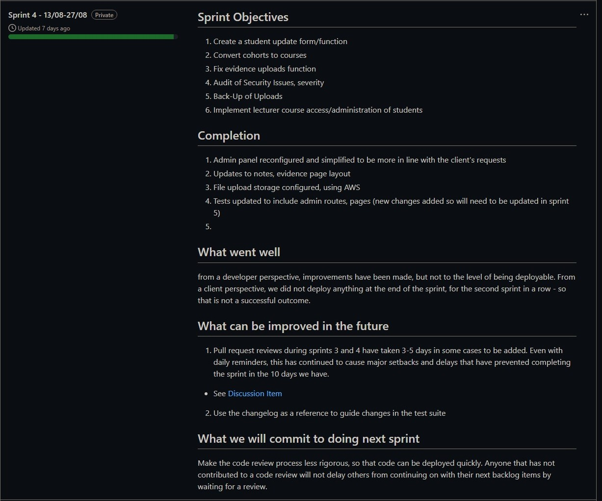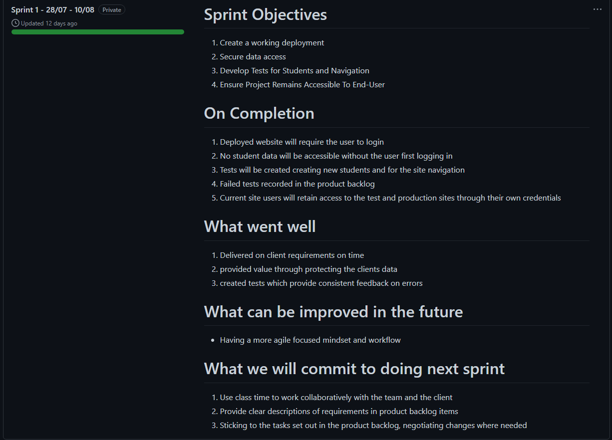

# Learning Outcome 2

>  Analyse and manage development challenges to create production-quality outputs.

## 2.1 Contribute to Automated Test Suite

#### [<u>GitHub</u>](https://github.com/BIT-Studio-4/team-project-2021-s2-team-delta/pulls?q=is%3Apr+is%3Aclosed+author%3Aleggant+-Action) Dusk Testing

Work began on this in sprint 1, was functional at the end of sprint 3 but was not able to be reliably utilised until sprint 5, when the dusk tests were functioning correctly both locally and in the GH actions container. This is now configured as a branch guard on the master and staging branches. Every commit and pull request on the repository is run tested.

1. [Sprint 1 #57 - sprint-1-laravel-deployment-testing](https://github.com/BIT-Studio-4/team-project-2021-s2-team-delta/pull/57)
2. [Sprint 2 #104 - sprint-2-github-deployment-actions](https://github.com/BIT-Studio-4/team-project-2021-s2-team-delta/pull/121)
3. [Sprint 2 #121 - sprint-2-github-deployment-actions](https://github.com/BIT-Studio-4/team-project-2021-s2-team-delta/pull/121)
4. [Sprint 3 #144 - sprint-3-github-dusk-action](https://github.com/BIT-Studio-4/team-project-2021-s2-team-delta/pull/144)
5. [#145 - Code Review](https://github.com/BIT-Studio-4/team-project-2021-s2-team-delta/pull/145)
6. [Sprint 3 #168 - sprint-3-deployment-fix](https://github.com/BIT-Studio-4/team-project-2021-s2-team-delta/pull/168)
7. [Sprint 4 #182 - sprint-4-github-action-updates](https://github.com/BIT-Studio-4/team-project-2021-s2-team-delta/pull/182)
8. [Sprint 4 #191 - sprint-4-auto-changelog](https://github.com/BIT-Studio-4/team-project-2021-s2-team-delta/pull/191)
9. [Sprint 4 #218 - sprint-4-github-action-updates](https://github.com/BIT-Studio-4/team-project-2021-s2-team-delta/pull/218)
10. [Sprint 5 #235 - logout security testing](https://github.com/BIT-Studio-4/team-project-2021-s2-team-delta/pull/235)

#### Code Linter Test

Configured a code [linter check GitHub action](https://github.com/BIT-Studio-4/team-project-2021-s2-team-delta/actions/workflows/Project_Linter_Check.yml?query=is%3Afailure) to run on every commit and set this as a branch rule/guard on production, staging and development branches.

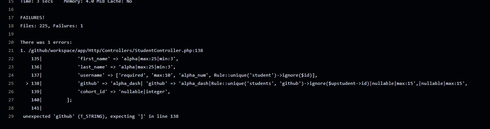

## 2.2 Contribute to Project Security

- [Security Audit](https://github.com/BIT-Studio-4/team-project-2021-s2-team-delta/discussions/194)

  
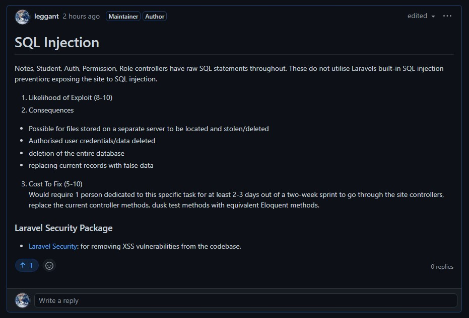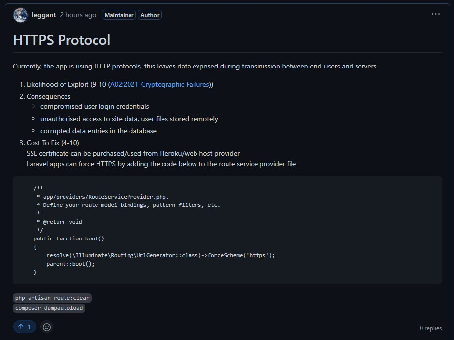

  

- [Student Evidence Uploads #127](https://github.com/BIT-Studio-4/team-project-2021-s2-team-delta/issues/127)

- [Student Evidence Upload Backup #128](https://github.com/BIT-Studio-4/team-project-2021-s2-team-delta/issues/128)

- [Evidence Security: Test S3 Bucket](https://github.com/BIT-Studio-4/team-project-2021-s2-team-delta/issues/215)

- [Code Review #75 - Publish Backup VM details in Readme](https://github.com/BIT-Studio-4/team-project-2021-s2-team-delta/pull/75#pullrequestreview-720604349)

- [Code Review #211 - private keys published to repo](https://github.com/BIT-Studio-4/team-project-2021-s2-team-delta/pull/211#issuecomment-930753339)

- [Composer Package Security Check GH Action](https://github.com/BIT-Studio-4/team-project-2021-s2-team-delta/actions/runs/1447789495/workflow) - Set this as a branch rule/guard on production and staging branches.

  
  
  
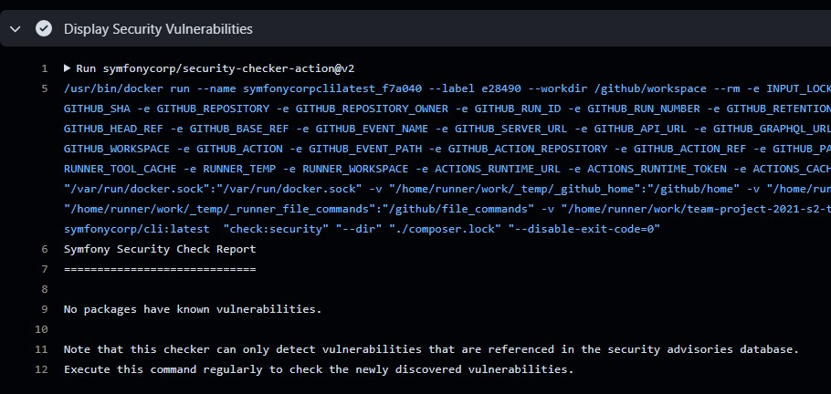

  
  

## 2.3 Contribution to Project Automation

In addition to the Heroku release script, automated dusk and linter tests, I also created the 7 other [GH actions](https://github.com/BIT-Studio-4/team-project-2021-s2-team-delta/actions) in the repository, [prettier code formatter](https://github.com/BIT-Studio-4/team-project-2021-s2-team-delta/blob/1784c0e68bc095e9b636e41ba395e06ec72afbc4/package.json#L18), [changelog generator](https://github.com/BIT-Studio-4/team-project-2021-s2-team-delta/pull/191), [commitizen git commit linter](https://github.com/BIT-Studio-4/team-project-2021-s2-team-delta/pull/191), and the [project kanban board (template)](https://github.com/BIT-Studio-4/team-project-2021-s2-team-delta/projects/4) automation, making a template version that could be copied with automation settings at the start of each sprint. 

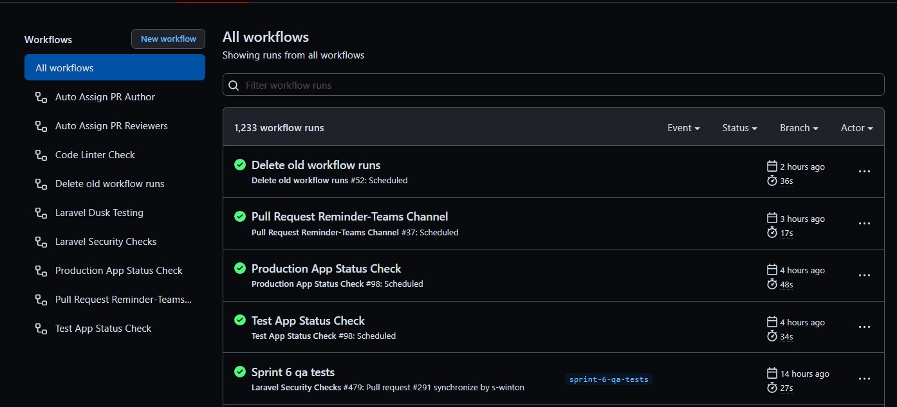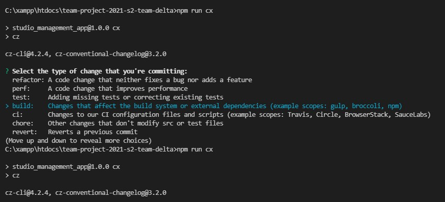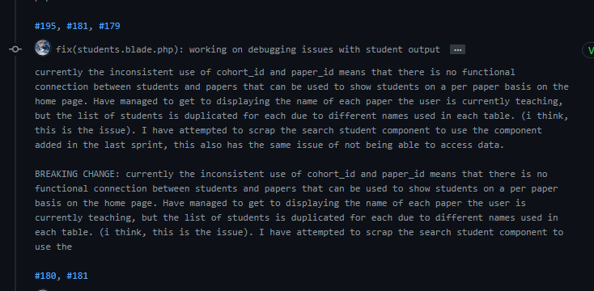

1. Automated assignment of pull request [reviewers](https://github.com/BIT-Studio-4/team-project-2021-s2-team-delta/actions/workflows/auto-assign-reviewers.yml) and [assignees](https://github.com/BIT-Studio-4/team-project-2021-s2-team-delta/actions/workflows/auto-assign-author.yml) - this was to stop this being forgotten about.

   
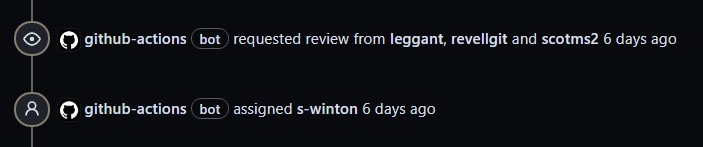

   

2. Configured GitHub Action to send [reminders to PR reviewers](https://github.com/BIT-Studio-4/team-project-2021-s2-team-delta/actions/workflows/pr-reminder.yml) if there are reviews that have not been completed. This is configured to send reminders to the project's teams channel using a web hook. 

   

   
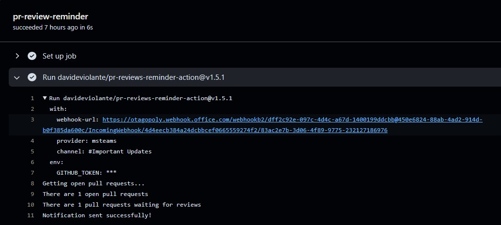

   

3. Configured [Prettier](https://github.com/BIT-Studio-4/team-project-2021-s2-team-delta/blob/master/.prettierrc) formatter, to scan and format project code locally. This included writing and testing the [configuration](https://github.com/BIT-Studio-4/team-project-2021-s2-team-delta/blob/staging/.prettierrc) and [ignore files](https://github.com/BIT-Studio-4/team-project-2021-s2-team-delta/blob/development/.prettierignore) to ensure this automation did not format any code that was not written by the project team.

4. Actions added that check the HTTP response from the [live test](https://github.com/BIT-Studio-4/team-project-2021-s2-team-delta/actions/workflows/test-http-check.yml) the [production apps](https://github.com/BIT-Studio-4/team-project-2021-s2-team-delta/actions/workflows/production-http-check.yml) if the live test app is down, a branch guard blocks merging to production until the issue causing the error is resolved.

   

   
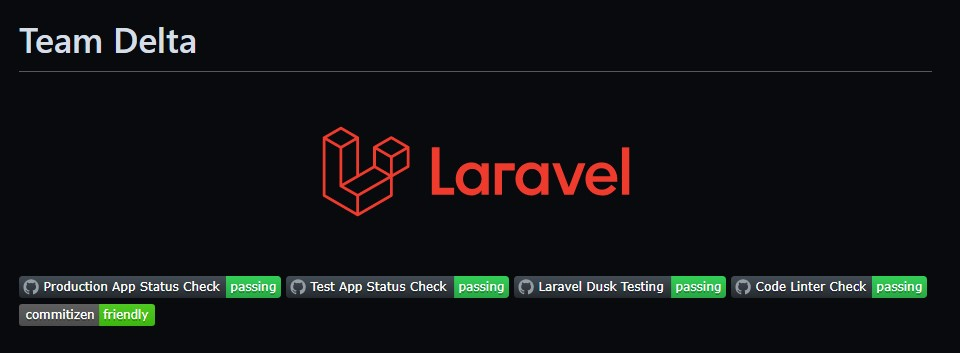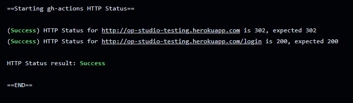

   

## 2.4 Participate in Code/Solution Review to Ensure High-Quality Outputs

1. [Pull Request #75 - Review 1](https://github.com/BIT-Studio-4/team-project-2021-s2-team-delta/pull/75#pullrequestreview-720604349) + [Review 2](https://github.com/BIT-Studio-4/team-project-2021-s2-team-delta/pull/75#discussion_r681280329)

2. [Pull Request #134 - Review 1 ](https://github.com/BIT-Studio-4/team-project-2021-s2-team-delta/pull/134#pullrequestreview-741151610) + [Review 2](https://github.com/BIT-Studio-4/team-project-2021-s2-team-delta/pull/134#pullrequestreview-741254586)

3. [Pull Request #198 - Review 1](https://github.com/BIT-Studio-4/team-project-2021-s2-team-delta/pull/198#pullrequestreview-764976097) + [Review 2](https://github.com/BIT-Studio-4/team-project-2021-s2-team-delta/pull/198#issuecomment-930517302)

4. [Pull Request #211 - Review 1](https://github.com/BIT-Studio-4/team-project-2021-s2-team-delta/pull/211#pullrequestreview-767355803) + [Review 2](https://github.com/BIT-Studio-4/team-project-2021-s2-team-delta/pull/211#pullrequestreview-767493942)

5. [#243 - dusk test suite](https://github.com/BIT-Studio-4/team-project-2021-s2-team-delta/pull/243#pullrequestreview-792630827)

6. [Full Code Review List](https://github.com/BIT-Studio-4/team-project-2021-s2-team-delta/pulls?q=is%3Apr+is%3Aclosed+reviewed-by%3A%40me)

   
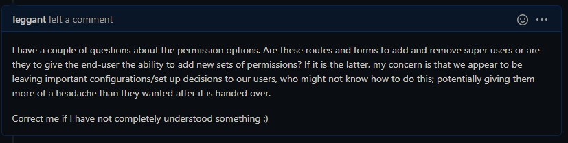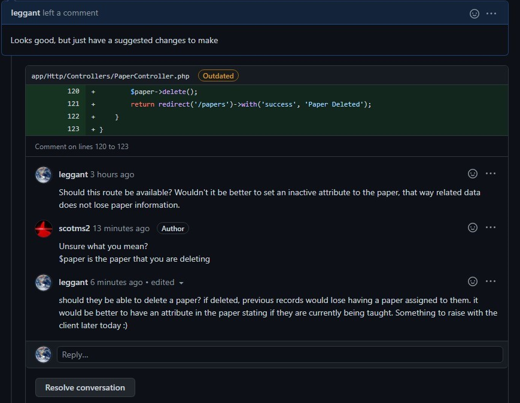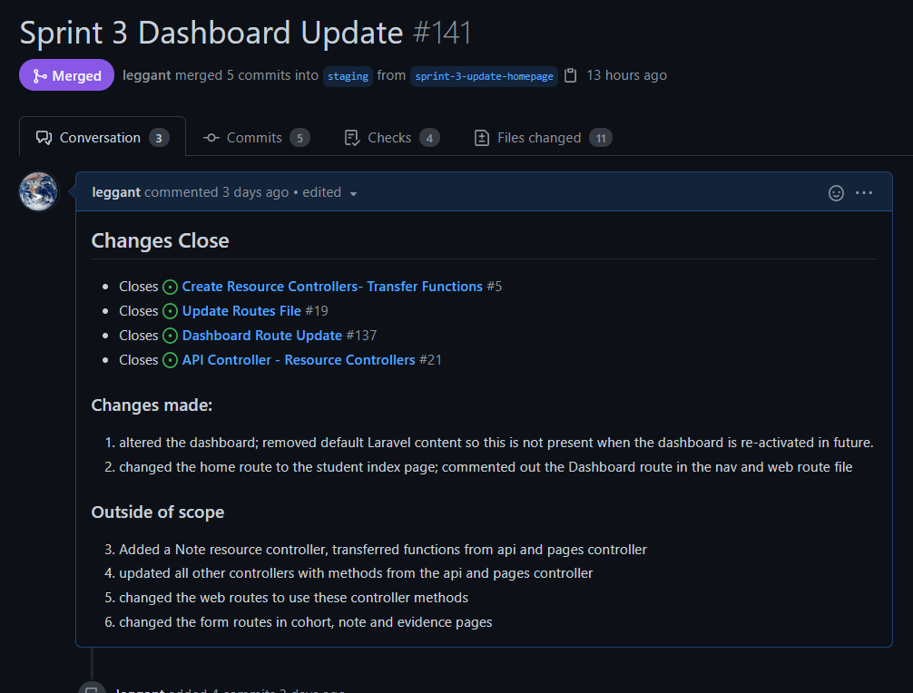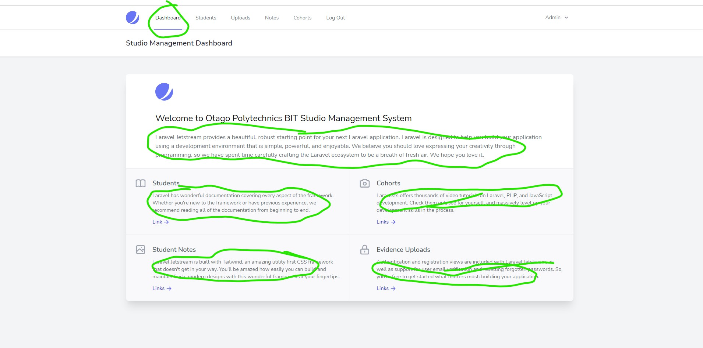

   

# Respond to feedback to produce high quality outputs

1. [Sprint 4 - Auto Changelog Script](https://github.com/BIT-Studio-4/team-project-2021-s2-team-delta/pull/191) was added in response to feedback given on our teams transparency and progress. The [changelog](https://github.com/BIT-Studio-4/team-project-2021-s2-team-delta/blob/master/CHANGELOG.md) output was included in the project release information and a commitlog generused in 
2. [Dashboard Route Update](https://github.com/BIT-Studio-4/team-project-2021-s2-team-delta/issues/137) + [Pull Request #141](https://github.com/BIT-Studio-4/team-project-2021-s2-team-delta/pull/141)
3. [Student Status](https://github.com/BIT-Studio-4/team-project-2021-s2-team-delta/issues/139) + [Pull Request #185](https://github.com/BIT-Studio-4/team-project-2021-s2-team-delta/pull/185)

#### Project Feedback

As mentioned above, feedback on our [user stories](https://github.com/BIT-Studio-4/team-project-2021-s2-team-delta/issues/65), particularly during the first three sprints was that they were not visible, lacked connection with the product backlog items, and were not kept up to date with feedback from the client. By separating our user stories and product backlog tickets our user stories became stale, our product back hard to follow, and project work lacked clearly defined goals. This feedback pushed us to close all the stale user stories, and refresh the current product backlog with current user stories. This immediately [made the point of each item much clearer](https://github.com/BIT-Studio-4/team-project-2021-s2-team-delta/issues/96) and easier to update and get feedback.

##### User Experience/User Stories

- [User Story: Set Up #209](https://github.com/BIT-Studio-4/team-project-2021-s2-team-delta/issues/209)
- [User Story: No Guessing Games #208](https://github.com/BIT-Studio-4/team-project-2021-s2-team-delta/issues/208)
- [User Story: Less Clicks #207](https://github.com/BIT-Studio-4/team-project-2021-s2-team-delta/issues/207)

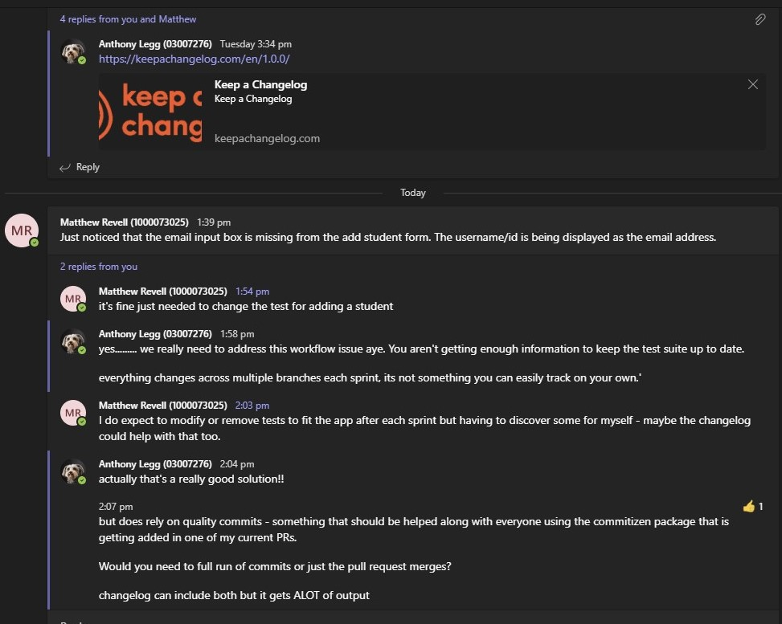

