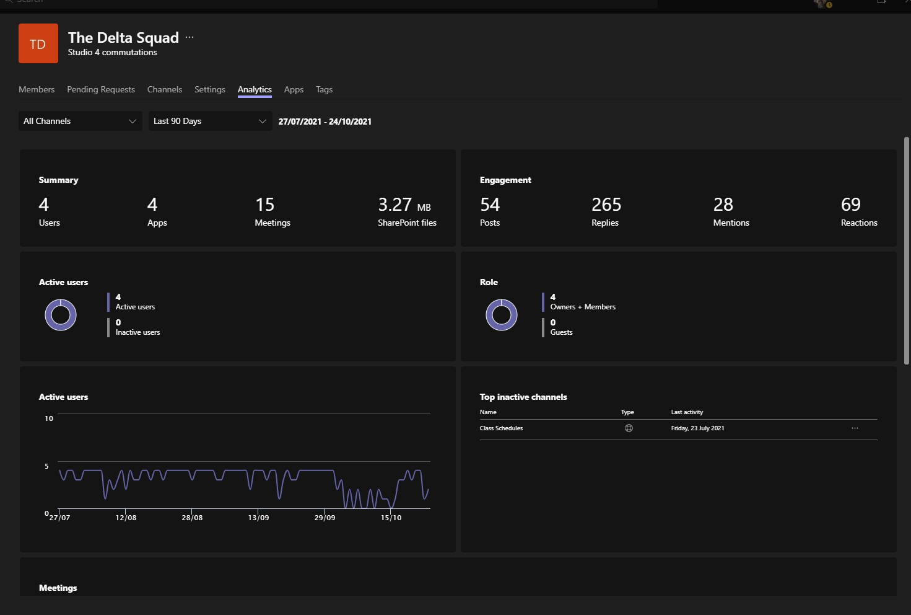

# Anthony Legg - Studio 4 PDR

[Link To GitHub Repo](https://GitHub.com/BIT-Studio-4/team-project-2021-s2-team-delta)
[Link To Studio 4 Test Website - add the link](https://#) 
[Link To Studio 4 Production Website](https://bit-studio-management.herokuapp.com/)

---

## Evidence For Submission

### What are your personal goals and objectives in addition to the course objectives?

Development of communication, leadership and stress-management skills continues to be a major goal. I think that I have improved in this area from last semester, buthere is definitely room for more improvement. I need to take let go more and take things much less personally. Working as part of a group is challenging; everyone has their way of doing things, so I need to be more patient and less reactive.

Would like to get more skills and experience in CI and CD, using services such as GitLab's or Azure DevOps to streamline the project from planning through to deployment. Would also like to apply some of the skills learn from the operations engineering paper in future projects. I think docker would have been hugely beneficial to this project, it would have eliminated some of the configuration issues across multiple development environments.

------

###  What has gone well? What are your strengths?

As a team we were able to improve all aspects of the project that we started with. The site has been made more secure, easy for the end user to navigate, consistently styled across all pages, and provides functionality to suit the clients needs. The most important thing is to deliver on the goals of the client; I think that ultimately we delivered on most of these objectives through regular team communication, and I think I times this has not b.
I think my strengths are honest communication, reliability, empathy and self-motivation. 

------

### What could have gone better and how?

------

### What are the next steps to take? What is your plan for further self-development?

------

### What barriers exist? How do you plan to deal with them?

------

### What is not clear or is uncertain?

# Learning Outcome 1

>  Select and apply industry-standard tools and processes to solve non-trivial problems in a team environment.

## 1.1 Contribute to development of new product features

### Front End Development

Mitchell's as the developer, had a lot of work to do to resolve important issues such as security, and development of new features. Some of these changes were complex, and time consuming; So that Mitchell was not overloaded with both front and backend development, I picked up some development tasks such as completing UI changes on new pages for new features so that Mitchell could continue developing other product backlog items that had a higher priority. By doing this I contributed to implementation the client requested changes across the site. 

- [Sprint 2 - #106(sprint-2-student-controller)](https://github.com/BIT-Studio-4/team-project-2021-s2-team-delta/pull/106)
- [Sprint 2 - #109(sprint-2-jetstream-templates)](https://github.com/BIT-Studio-4/team-project-2021-s2-team-delta/pull/109)
- [Sprint 3 - #141(sprint-3-update-homepage)](https://github.com/BIT-Studio-4/team-project-2021-s2-team-delta/pull/141)
- [Sprint 4 - #184(sprint-4-student-update-form)](https://github.com/BIT-Studio-4/team-project-2021-s2-team-delta/pull/184)
- [Sprint 4 - #185(sprint-4-student-status)](https://github.com/BIT-Studio-4/team-project-2021-s2-team-delta/pull/185)
- [Sprint 4 - #196 (sprint-4-student-update-form)](https://github.com/BIT-Studio-4/team-project-2021-s2-team-delta/pull/196)
- [Sprint 4 - #212 (sprint-4-admin-panel-deployment-fixes)](https://github.com/BIT-Studio-4/team-project-2021-s2-team-delta/pull/212)
- [Sprint 5 - #241 (sprint-5-homepage-layout-update)](https://github.com/BIT-Studio-4/team-project-2021-s2-team-delta/pull/241)
- [Sprint 5 - #250 (sprint-5-homepage-layout-update)](https://github.com/BIT-Studio-4/team-project-2021-s2-team-delta/pull/250)
- [Sprint 6 - #269 (sprint-6-layout-bug-fix)](https://github.com/BIT-Studio-4/team-project-2021-s2-team-delta/pull/269)

### Final UI Changes

## 1.2 Contribute to Project Deployment

1. Set-Up the pipeline configuration on Heroku, linked this back to the repo at the start of the semester
  - Added the team as members
  - Set up the database on the Heroku production app
2. Configured, [tested](https://github.com/BIT-Studio-4/team-project-2021-s2-team-delta/pull/168) [release script](https://github.com/BIT-Studio-4/team-project-2021-s2-team-delta/commits/57bc21c36124b2856e32ad911d42cd9f3e8d4060/scripts/heroku.sh) and [Procfile](https://github.com/BIT-Studio-4/team-project-2021-s2-team-delta/blob/master/Procfile) to run migrations automatically on both Heroku applications. This previously needed to be done manually each time a pull request was merged to the staging and master branches.

3. Sprint 4, I discovered that Heroku was serving content from a `main` branch, this meant that when we deployed, code was being pushed to a `master` branch and was not getting served; to resolve this I had to merge `master` into the `main` branch, resolve merge conflicts and recompile CSS and JS files locally before pushing back to the Heroku repository.
- [Issue #104 - GitHub Action - Check Deployment](https://github.com/BIT-Studio-4/team-project-2021-s2-team-delta/issues/104)
- [Issue #121 - Sprint 2 GitHub Deployment Actions](https://github.com/BIT-Studio-4/team-project-2021-s2-team-delta/pull/121)
- [Issue #152 - Monitoring Deployment](https://github.com/BIT-Studio-4/team-project-2021-s2-team-delta/issues/152)
- [PR #164 - sprint-3-deployment-fix](https://github.com/BIT-Studio-4/team-project-2021-s2-team-delta/pull/164)
- [PR #168 - sprint-3-deployment-fix](https://github.com/BIT-Studio-4/team-project-2021-s2-team-delta/pull/168)
https://github.com/BIT-Studio-4/team-project-2021-s2-team-delta/pulls?q=is%3Apr+is%3Aclosed+author%3Aleggant+-Action

------

## 1.3  Contribute to CI/CD solution
- Configured the GitHub Dusk Test Action + Set it as a branch guard during sprint 5 when the test suite was working reliably
  - Work began on this in sprint 1 - is now ready to be deployed as a guard on the master and staging branches
  - also configured changes in the Laravel app settings which were preventing the Dusk test working on GitHub
  - [Pull Request #57 - Sprint 1](https://github.com/BIT-Studio-4/team-project-2021-s2-team-delta/pull/57)
  - [Pull Request #121 - Sprint 2](https://github.com/BIT-Studio-4/team-project-2021-s2-team-delta/pull/121)
  - [Pull Request #144 - Sprint 3](https://github.com/BIT-Studio-4/team-project-2021-s2-team-delta/pull/144)
  - [Pull Request #164 - Sprint 3](https://github.com/BIT-Studio-4/team-project-2021-s2-team-delta/pull/164)
- configured node git commit linter, provided guide for others to adopt its use. This was to standardise commit messages, while prompting everyone to provide more robust commit messages that help to make the repo changelog and release log more informative.
- configured linter check GitHub action, set this so it prevents code that does not meet the standard from getting merged into the master or the staging branches.
  - At the same time I added a prettier script to run through the whole project, and fix issues with spacing and messy code blocks. 
- Configured test app http response action
- Configured production app http response action
- Configured Pull Request Reminder action - this sends a reminder to any team member that has a code review to be completed via a web hook on our groups Teams channel.

------

## 1.4 Demonstrate Improvements in Applying Agile Project Management
1. At the end of sprint 2, we had run behind schedule, and needed to begin prepartation for sprint 3. We made the mistake of deploying to production, without first getting final signoff. 
	- At this point much stricter [branch rules](https://github.com/BIT-Studio-4/team-project-2021-s2-team-delta/settings/branches) were put in place to avoid this occurring again. 
	- This mistake caused us to think much more critically at our product backlog in the sprint planning stage.
2. *Client feedback* During [sprint 3](https://github.com/BIT-Studio-4/team-project-2021-s2-team-delta/milestone/3), the team had a review with the product owner to get feedback on changes in the UI layout and colour scheme. Feedback received was immediately acted on rather than being recorded as a user story, and a action plan for the next sprint.
	- again this mistake reinforced the need to note the users feedback in the form of user stories
	- then plan/propose changes; add to the product backlog, and get further feedback from the client before proceeding with any new feature or change.
3. *User stories* As a team we regularly got feedback about our [user stories](https://github.com/BIT-Studio-4/team-project-2021-s2-team-delta/issues/65), their lack of visibility in the product backlog, and the need to keep these relevant. Initially we had our user stories separate from our product backlog items, instead linking these using a [hash tag](https://github.com/BIT-Studio-4/team-project-2021-s2-team-delta/issues/65#issuecomment-894732282). By sprint 3, it became clear doing this made our user stories stale and our product back hard to follow, even for us. At this point all the stale user stories were closed, and the current product backlog updated with current user stories. This immediately [made the point of each item much clearer](https://github.com/BIT-Studio-4/team-project-2021-s2-team-delta/issues/96) and easier to update with client feed back.
4. *Scrum*
5. Set goals for each sprint, shared on both the [sprint project board](https://github.com/BIT-Studio-4/team-project-2021-s2-team-delta/projects) and on the sprint [milestone](https://github.com/BIT-Studio-4/team-project-2021-s2-team-delta/milestones?state=closed) alongside the sprint retrospective.
6. *Team Engagement*
   - Regular engagement via Teams, stand up meetings
7. [Project Discussion Pages](https://github.com/BIT-Studio-4/team-project-2021-s2-team-delta/discussions)
   - to communicate, share ideas and [resources](https://github.com/BIT-Studio-4/team-project-2021-s2-team-delta/discussions/4)
   - [get feedback on project workflow](https://github.com/BIT-Studio-4/team-project-2021-s2-team-delta/discussions/150) improvements
8. [Project Wiki](https://github.com/BIT-Studio-4/team-project-2021-s2-team-delta/wiki)
   - [Stand up Meeting Plan](https://github.com/BIT-Studio-4/team-project-2021-s2-team-delta/wiki/06.-Meeting-&-Class-Scheduling)
   - [GitHub Guide](https://github.com/BIT-Studio-4/team-project-2021-s2-team-delta/wiki/03.-GitHub-Guide)
   - [Project Scrum Guide](https://github.com/BIT-Studio-4/team-project-2021-s2-team-delta/wiki/01.-Project-Scrum-Guide) - Needs to be updated
   - [Project Sprint Plan](https://github.com/BIT-Studio-4/team-project-2021-s2-team-delta/wiki/02.-Project-Sprint-Guide) - Also needs to be completed.
     https://github.com/BIT-Studio-4/team-project-2021-s2-team-delta/discussions/217

------

## 1.5 Use industry-standard communication and project management tools in a professional manner

1. [GitHub Discussion Boards](https://github.com/BIT-Studio-4/team-project-2021-s2-team-delta/discussions)

2. Teams Channel - Stand Up Meetings

3. Project Releases

4. GitHub Wiki

5. Repo Changelog

6. Repo Commitlog

# Learning Outcome 2

>  Analyse and manage development challenges to create production-quality outputs.
**Improve the quality of the project (two or more of the following)**

## Contribute to Automated Test Suite

Sprints 1-3 I worked to get the GitHub automated test suite to work. This was up and running at the end of sprint 3.
1. [Sprint 1 PR #57 - sprint-1-laravel-deployment-testing](https://github.com/BIT-Studio-4/team-project-2021-s2-team-delta/pull/57)
2. [Sprint 2 PR #121 - sprint-2-github-deployment-actions](https://github.com/BIT-Studio-4/team-project-2021-s2-team-delta/pull/121)
3. [Sprint 3 PR #144 - sprint-3-github-dusk-action](https://github.com/BIT-Studio-4/team-project-2021-s2-team-delta/pull/144)
4. [Sprint 4 - Auto Changelog Script](https://github.com/BIT-Studio-4/team-project-2021-s2-team-delta/pull/191) was implemented in response to 
5. configured node git commit linter, provided guide for others to adopt its use. This was to standardise commit messages, while prompting everyone to provide more robust commit messages that help to make the repo changelog and release log more informative.
6. configured linter check GitHub action, set this so it prevents code that does not meet the standard from getting merged into the master or the staging branches.
   - At the same time I added a prettier script to run through the whole project, and fix issues with spacing and messy code blocks. 
7. Configured test app http response action
8. Configured production app http response action
9. Configured Pull Request Reminder action - this sends a reminder to any team member that has a code review to be completed via a web hook on our groups Teams channel.
10. [Sprint 5 logout security testing](https://github.com/BIT-Studio-4/team-project-2021-s2-team-delta/pull/235)

## Contribute to Project Security

- [Performed a security audit to identify potential vulnerabilities](https://github.com/BIT-Studio-4/team-project-2021-s2-team-delta/discussions/194)
- [Code Review - private keys published to repo](https://github.com/BIT-Studio-4/team-project-2021-s2-team-delta/pull/211#issuecomment-930753339)

## Contribution to Project Automation (CI/CD)

https://github.com/BIT-Studio-4/team-project-2021-s2-team-delta/pulls?q=is%3Apr+is%3Aclosed+author%3Aleggant+-Action
Project Board Template https://github.com/BIT-Studio-4/team-project-2021-s2-team-delta/projects/4
GitHub Actions https://github.com/BIT-Studio-4/team-project-2021-s2-team-delta/actions
1. Configured the dusk test action, set this as a branch rule/guard on production and staging branches.
	- [sprint-1-laravel-deployment-testing](https://github.com/BIT-Studio-4/team-project-2021-s2-team-delta/pull/57)
	- [sprint-2-github-deployment-actions](https://github.com/BIT-Studio-4/team-project-2021-s2-team-delta/pull/121)
	- [sprint-3-github-dusk-action](https://github.com/BIT-Studio-4/team-project-2021-s2-team-delta/pull/144)
	- [sprint-3-deployment-fix](https://github.com/BIT-Studio-4/team-project-2021-s2-team-delta/pull/164)
	- [sprint-4-github-action-updates](https://github.com/BIT-Studio-4/team-project-2021-s2-team-delta/pull/182)
	- [sprint-4-auto-changelog](https://github.com/BIT-Studio-4/team-project-2021-s2-team-delta/pull/191)
	- [sprint-4-github-action-updates](https://github.com/BIT-Studio-4/team-project-2021-s2-team-delta/pull/218)
2. Automated assignment of pull request reviewers and assignees
3. Configured automated project kanban board - created a template version that could be copied for each sprint.
4. Configured GitHub Action to send reminders to PR reviewers if there are reviews that have not been completed. This is configured to send reminders via the project's teams channel. 
5. Composer automated security check actions. Set this as a branch rule/guard on production and staging branches.
6. Configured automated code linter check action. Set this as a branch rule/guard on production and staging branches.
7. Configured `Prettier` formatter, to scan and format project code locally. This included writing and testing the [configuration](https://github.com/BIT-Studio-4/team-project-2021-s2-team-delta/blob/staging/.prettierrc) and [ignore files](https://github.com/BIT-Studio-4/team-project-2021-s2-team-delta/blob/development/.prettierignore) to ensure this automation did not format any code that was not written by the project team.
8. Configured a branch merge guard which checks the status of the live test app to make sure this has not been 
9. Configured Commitizen as a project dev dependency
    https://github.com/BIT-Studio-4/team-project-2021-s2-team-delta/pull/191
10. configured node git commit linter, provided guide for others to adopt its use. This was to standardise commit messages, while prompting everyone to provide more robust commit messages that help to make the repo changelog and release log more informative.
11. configured linter check GitHub action, set this so it prevents code that does not meet the standard from getting merged into the master or the staging branches.
    - At the same time I added a prettier script to run through the whole project, and fix issues with spacing and messy code blocks. 
12. Configured test app http response action
13. Configured production app http response action
14. Configured Pull Request Reminder action - this sends a reminder to any team member that has a code review to be completed via a web hook on our groups Teams channel.

## [Participate in Code/Solution Review](https://github.com/BIT-Studio-4/team-project-2021-s2-team-delta/pulls?q=is%3Apr+reviewed-by%3A%40me+is%3Aclosed) to Ensure High-Quality Outputs

1. [Pull Request #75 - Review 1](https://github.com/BIT-Studio-4/team-project-2021-s2-team-delta/pull/75#pullrequestreview-720604349)+ [Review 2](https://github.com/BIT-Studio-4/team-project-2021-s2-team-delta/pull/75#discussion_r681280329)
2. [Pull Request #81 - Sprint 1](https://github.com/BIT-Studio-4/team-project-2021-s2-team-delta/pull/81#discussion_r683180317)
3. [Pull Request #134 - Review 1 ](https://github.com/BIT-Studio-4/team-project-2021-s2-team-delta/pull/134#pullrequestreview-741151610) + [Review 2](https://github.com/BIT-Studio-4/team-project-2021-s2-team-delta/pull/134#pullrequestreview-741254586)
4. 
5. [Pull Request #198 - Sprint 4](https://github.com/BIT-Studio-4/team-project-2021-s2-team-delta/pull/198)
   - [Pull Request #198 - Sprint 4](https://github.com/BIT-Studio-4/team-project-2021-s2-team-delta/pull/198#pullrequestreview-764976097)
   - [Pull Request #198 - Sprint 4](https://github.com/BIT-Studio-4/team-project-2021-s2-team-delta/pull/198#issuecomment-930517302)
6. [Pull Request #211](https://github.com/BIT-Studio-4/team-project-2021-s2-team-delta/pull/211) 
   - [Review 1](https://github.com/BIT-Studio-4/team-project-2021-s2-team-delta/pull/211#issuecomment-930722940) 
   - [Review 2](https://github.com/BIT-Studio-4/team-project-2021-s2-team-delta/pull/211#pullrequestreview-767355803)
   - [Review 3](https://github.com/BIT-Studio-4/team-project-2021-s2-team-delta/pull/211#pullrequestreview-767493942)

[Full List Closed of My Pull Requests](https://github.com/BIT-Studio-4/team-project-2021-s2-team-delta/pulls?q=is%3Apr+is%3Aclosed+author%3Aleggant)
[Full List of Pull Requests Not Reviewed By Me](https://github.com/BIT-Studio-4/team-project-2021-s2-team-delta/pulls?page=1&q=is%3Apr+is%3Aclosed+-reviewed-by%3A%40me)

https://github.com/BIT-Studio-4/team-project-2021-s2-team-delta/pull/211#pullrequestreview-767355803
https://github.com/BIT-Studio-4/team-project-2021-s2-team-delta/pull/211#pullrequestreview-767355634

#224
https://github.com/BIT-Studio-4/team-project-2021-s2-team-delta/pull/224
https://github.com/BIT-Studio-4/team-project-2021-s2-team-delta/pull/224#pullrequestreview-782832634
https://github.com/BIT-Studio-4/team-project-2021-s2-team-delta/pull/224#issuecomment-946420673
https://github.com/BIT-Studio-4/team-project-2021-s2-team-delta/pull/224#issue-1029639977

#242
https://github.com/BIT-Studio-4/team-project-2021-s2-team-delta/pull/242

#243 - dusk test suite
https://github.com/BIT-Studio-4/team-project-2021-s2-team-delta/pull/243#pullrequestreview-792630827
https://github.com/BIT-Studio-4/team-project-2021-s2-team-delta/pull/243#issuecomment-954450021

#281
https://github.com/BIT-Studio-4/team-project-2021-s2-team-delta/pull/281#issuecomment-963584921
https://github.com/BIT-Studio-4/team-project-2021-s2-team-delta/pull/197#pullrequestreview-765211787

#198
https://github.com/BIT-Studio-4/team-project-2021-s2-team-delta/pull/198#pullrequestreview-764976097
https://github.com/BIT-Studio-4/team-project-2021-s2-team-delta/pull/198#issuecomment-930517302

# 2.2 Respond to feedback to produce high quality outputs

2. [Pull Request #106](https://github.com/BIT-Studio-4/team-project-2021-s2-team-delta/pull/106#pullrequestreview-728209790) 

https://github.com/BIT-Studio-4/team-project-2021-s2-team-delta/issues/137
https://github.com/BIT-Studio-4/team-project-2021-s2-team-delta/pull/141
https://github.com/BIT-Studio-4/team-project-2021-s2-team-delta/pull/185
https://github.com/BIT-Studio-4/team-project-2021-s2-team-delta/pulls?q=is%3Apr+author%3Aleggant+is%3Aclosed

https://github.com/BIT-Studio-4/team-project-2021-s2-team-delta/issues/209
https://github.com/BIT-Studio-4/team-project-2021-s2-team-delta/issues/208

https://github.com/BIT-Studio-4/team-project-2021-s2-team-delta/issues?q=is%3Aissue+is%3Aclosed+author%3Aleggant
https://github.com/BIT-Studio-4/team-project-2021-s2-team-delta/pulls?q=is%3Apr+is%3Aclosed+author%3Aleggant
https://github.com/BIT-Studio-4/team-project-2021-s2-team-delta/pulls?q=is%3Apr+is%3Aclosed+reviewed-by%3A%40me