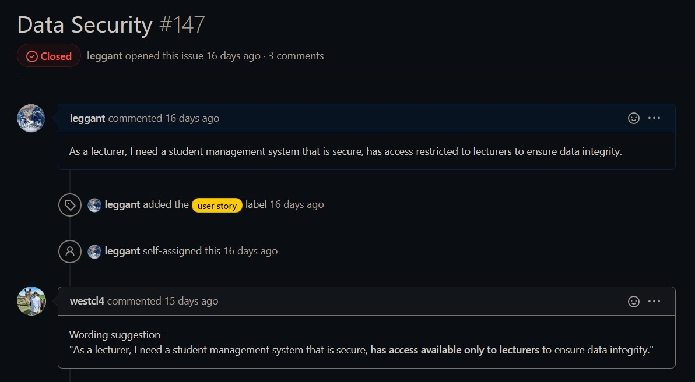
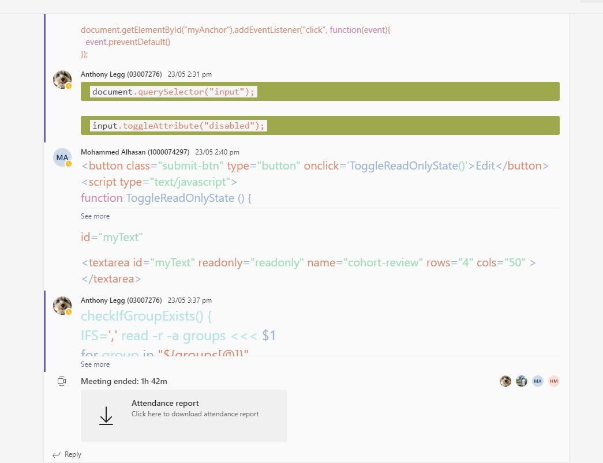
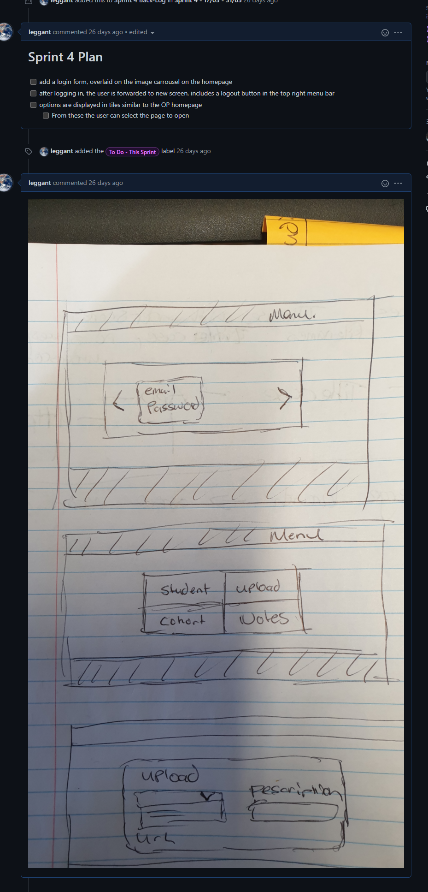
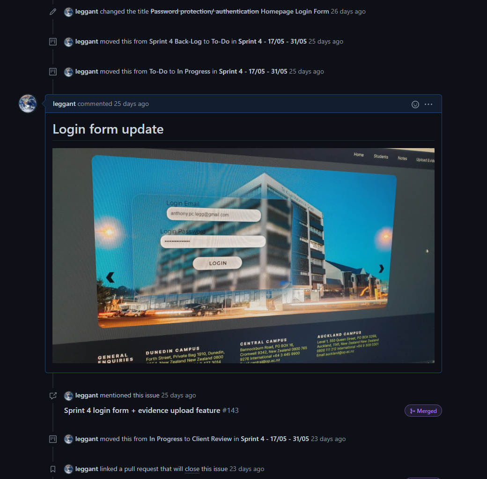
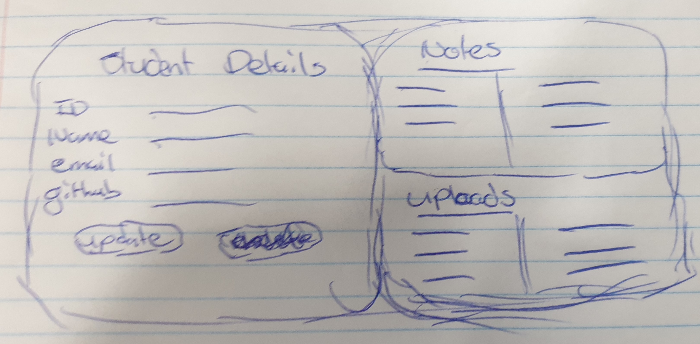
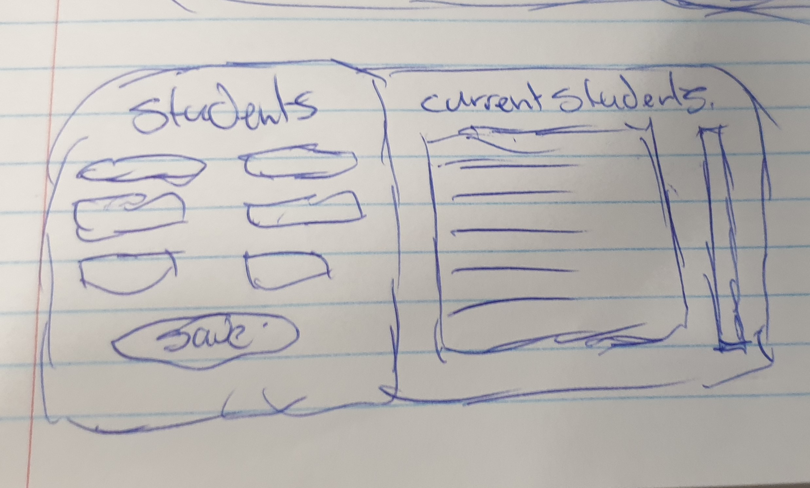
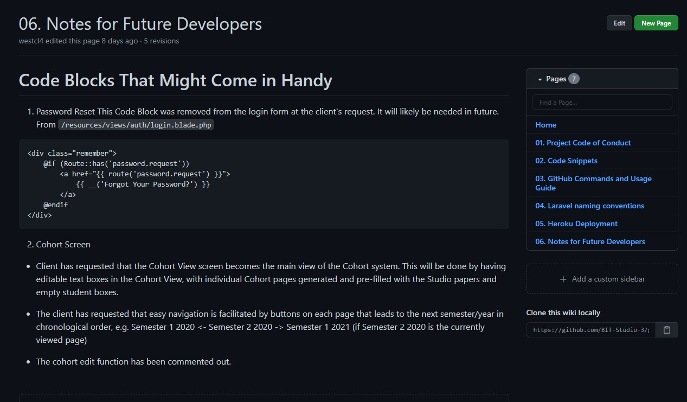

# Anthony Legg - Studio 3 Final PDR

[Link To GitHub Repo](https://github.com/BIT-Studio-3/group-project-21-1-budget-marvel-avengers)

[Link To Studio Website](http://bit-studio.herokuapp.com/login)

[Link to GitHub Markdown PDR](https://github.com/leggant/2021-BIT/blob/studio-3-PDR/Studio-3/Final-PDR/AnthonyLeggPDR.md)

## Evidence For Submission

### What are your personal goals and objectives in addition to the course objectives?

#### PDR-1

A major goal for me is to develop and improve my communication, leadership and stress-management skills. I would like to work on being less reactive when issues arise; this reaction does not serve me well or anyone else. 

#### Final PDR:

The goals outlined in my first PDR remain the same. I would like to continue to develop leadership, communication skills; I know that if I put  better stress management practices in place, my interactions with others during high pressure, conflicting situations could be improved. 

###  What has gone well? What are your strengths?

#### PDR-1:

Strengths are communication, reliability, empathy and self-motivation. The project team made a number of changes following the first sprint; placing more emphasis on working together and communicating more frequently.

#### Final PDR

Despite the many challenges faced, the core team consistently worked together to overcome them and meet the clients objectives. 

- Motivated and engaged team members throughout the project.  
- A supportive team environment, everyone's input was valued
- Anyone that faced a hurdle was able to get help/advice from others in the group.
- Daily contact throughout the sprint, during mid-semester break. This helped to ensure everyone was sticking the sprint plan and would be prepared for the next meeting with the client. 
- Despite all the strong personalities in the group, there was never any clashing. Differences in opinions and understanding of a issue were talked, and worked through.
- Frequent communication on and off campus. 

### What could have gone better and how?

#### PDR-1:

The projects first sprint was chaotic; I think it was hindered by each of us concentrating solely on completing tasks related to our feature and getting up to speed with our other papers. Working in isolation at the very beginning of the project meant that our code only worked in isolation. When it came to merging, we had a major issues. From this point we began making more of an effort to communicate daily in some form and requesting changes in our code reviews so that naming conventions align across branches. 

#### Final PDR:

- Group members held on to the mindset that sections of the app were theirs. Sprint 3, I tried to make the point that this was creating an inconsistent user experience, and that we needed to make sure that each part of the site was not so isolated that it creates an inconsistent user experience; This took some work to shift this mindset, which was still causing issues in sprint 5. 
- GitHub was a source of anxiety for some on the team. I think there is a lack of understanding of it, and how to handle it when it breaks which turned a few of the guys away from using its other features. Result was that the rest of us had to pick up managing the repo, keeping project board up to date, updating the Wiki.
- Lack of regular class attendance resulted in misunderstandings about what the client required. Communicating this information more proactively could helped to bridge this gap.

### What are the next steps to take? What is your plan for further self-development?

#### PDR-1

Next steps are to keep actively engaging the project team; try to create a space where everyone has equal opportunity to have input on the project while not allowing progress to slow down due to lack of engagement. Self-development needs to include researching Laravel to figure out the best solution. 

#### Final PDR:

Next steps are to keep challenging myself, continue to further develop the skills needed to work well within a team environment. I would like to better handle conflict so that I avoid taking a problem personally. For example, when a team member ignores something that was agreed to by everyone and documented in the project Wiki. Stress management is still a on-going issue for me which I need to pay more attention too. This affects how I interact with people in stressful situations. In terms of sustainability, I need to work harder to take better care of myself so that I interact with others more positively, when conflicts occur.

### What barriers exist? How do you plan to deal with them?

#### PDR-1

At this point, there are a couple of major issues within the project team. Engagement of all 5 team members in the project GitHub repo, sprint planning, group work and code reviews is one issue for 2 team members. One team member is rarely available, does not make contact us unless it is to let us know he will not be available. We are keeping him up-to-date via teams, providing him assistance to get his home development environment set-up and helping him with Laravel and blade templating which he has been struggling with. We are assigning him tasks that give him some space to learn Laravel while working on CSS and app deployment which are more familiar and easier to achieve while he gets up to speed.  

#### Final PDR

The issues described in PDR-1 generally remained the same through to the end of the last sprint. 

- Because we were told at the start that we were individually responsible for our feature, there was a tendency to not share the load. I think more effort needs to be put into alternating features between sprints

- My own personal barriers, have been my stress management. I have to get this in check by finding effective ways of managing a balance between study and the things I enjoy outside of it. Something that is seriously lacking for me right now.

  

### What is not clear or is uncertain?

**PDR-1:** How to get everyone to take part in the project repo. Seems like 3 of us are really engaged in keeping it up to date, making submissions to the sprint reflection, code reviews. How to get more input from the client during the sprint is also something we need to address.

**Final PDR:** 

- I think we needed more guidance on how to handle what was happening with Joseph, we all tried so hard to include him, support him and get his input. 
- There was inconsistent messaging on responsibility of features in that initially we were told that we would individually be responsible for one feature, then this changed to everyone is responsible for all features, then it shifted back to individuals. This confused us, and is still confusing. Contributed to the resistance to sharing the workload on features. 

# Learning Outcome 1

>  Analyse user requirements to inform technical project work and produce user-centric functionality. 

## 1.1 Capture project requirements in the form of User Stories

### <a href="https://github.com/BIT-Studio-3/group-project-21-1-budget-marvel-avengers/issues/137" target="_blank">Login System | Issue #137</a>

### [Data Security | Issue #147](https://github.com/BIT-Studio-3/group-project-21-1-budget-marvel-avengers/issues/147)

### [Evidence Uploads | Issue #9](https://github.com/BIT-Studio-3/group-project-21-1-budget-marvel-avengers/issues/9)

## 1.2 Contribute in a meaningful way to coding and releasing features that meet the user requirements

A large part of my contribution in this area to organise the team, pushing them when needed to write a code review, attend a stand up meeting or code jam and to keep them on target.

1. [Upload Student Evidence Links #9](https://github.com/BIT-Studio-3/group-project-21-1-budget-marvel-avengers/issues/9)
2. [Evidence Form Upload - With CRUD #127](https://github.com/BIT-Studio-3/group-project-21-1-budget-marvel-avengers/pull/127)
3. [Homepage Login Form #137](https://github.com/BIT-Studio-3/group-project-21-1-budget-marvel-avengers/issues/137)
4. [User registration system protection + error handling #156](https://github.com/BIT-Studio-3/group-project-21-1-budget-marvel-avengers/pull/156)
5. [Sprint 4 authentication system #148](https://github.com/BIT-Studio-3/group-project-21-1-budget-marvel-avengers/pull/148)
6. [Data Security #147](https://github.com/BIT-Studio-3/group-project-21-1-budget-marvel-avengers/issues/147)
7. [Sprint 5 css update #182](https://github.com/BIT-Studio-3/group-project-21-1-budget-marvel-avengers/pull/182)
8. [Sprint 5 - Deployment Merge #186](https://github.com/BIT-Studio-3/group-project-21-1-budget-marvel-avengers/pull/186)

#### [GitHub Insights](https://github.com/BIT-Studio-3/group-project-21-1-budget-marvel-avengers/pulse)

## 1.3 Demonstrate an iterative approach to project work using Design Thinking techniques

### Sprint 4 - Login Form

 [Homepage Login Form #137](https://github.com/BIT-Studio-3/group-project-21-1-budget-marvel-avengers/issues/137)

  

### Sprint 5 - Layout Updates

- [Sprint 5 - Update Layout Issue #160](https://github.com/BIT-Studio-3/group-project-21-1-budget-marvel-avengers/issues/160)
- [Sprint 5 - Homepage Updates Issue #119](https://github.com/BIT-Studio-3/group-project-21-1-budget-marvel-avengers/issues/119)

 

## 1.4 Participate in code review to ensure high-quality outputs

<a href="https://github.com/BIT-Studio-3/group-project-21-1-budget-marvel-avengers/pulls?q=is%3Apr+is%3Aclosed+reviewed-by%3A%40me" target="_blank" >List Of All My Code Reviews</a>

- https://github.com/BIT-Studio-3/group-project-21-1-budget-marvel-avengers/pull/152#pullrequestreview-669662404

- https://github.com/BIT-Studio-3/group-project-21-1-budget-marvel-avengers/pull/174#discussion_r646311388

- https://github.com/BIT-Studio-3/group-project-21-1-budget-marvel-avengers/pull/174#discussion_r646259032

- https://github.com/BIT-Studio-3/group-project-21-1-budget-marvel-avengers/pull/132#pullrequestreview-657520076

- https://github.com/BIT-Studio-3/group-project-21-1-budget-marvel-avengers/pull/132#discussion_r630780850

- https://github.com/BIT-Studio-3/group-project-21-1-budget-marvel-avengers/pull/132#discussion_r630782857

- https://github.com/BIT-Studio-3/group-project-21-1-budget-marvel-avengers/pull/148#discussion_r639265481

- https://github.com/BIT-Studio-3/group-project-21-1-budget-marvel-avengers/pull/133#discussion_r631518914

  

    

  

# Learning Outcome 2

>  Employ ethical and sustainable development methodologies and tools in a team environment. 

## 2.1 Communicate within a team in order to maintain sustainable productivity

### Messenger

   

 

 

### Microsoft Teams

      

 

Regular Teams meetings allowed us to keep in touch off campus, help each other out with code issues, and maintain the momentum needed during each sprint.

### GitHub

#### [Project Kanban Boards](https://github.com/BIT-Studio-3/group-project-21-1-budget-marvel-avengers/projects?query=is%3Aopen+sort%3Acreated-asc) 

I continuously checked in on this to see how things were track, updating completed tasks with new labels, and moving cards to keep these up to date. Also 

          

#### Issues

1. [Deploy to Heroku #85](https://github.com/BIT-Studio-3/group-project-21-1-budget-marvel-avengers/issues/85) 
2. [NPM Compiler Errors #74]( https://github.com/BIT-Studio-3/group-project-21-1-budget-marvel-avengers/issues/74) 
3. [Required Student Fields #58](https://github.com/BIT-Studio-3/group-project-21-1-budget-marvel-avengers/issues/58)
4. [Add required attribute to required input fields #163](https://github.com/BIT-Studio-3/group-project-21-1-budget-marvel-avengers/issues/163)

#### Wiki

I made contributions to the following wiki pages, [also requested others for input into the code of conduct](https://github.com/BIT-Studio-3/group-project-21-1-budget-marvel-avengers/issues/99) page so the rules outlined were known and discussed.

1. [Wiki Home](https://github.com/BIT-Studio-3/group-project-21-1-budget-marvel-avengers/wiki)

2. [Code Of Conduct](https://github.com/BIT-Studio-3/group-project-21-1-budget-marvel-avengers/wiki/01.-Project-Code-of-Conduct)

3. [Code Snippets](https://github.com/BIT-Studio-3/group-project-21-1-budget-marvel-avengers/wiki/02.-Code-Snippets)

4. [Heroku Deployment](https://github.com/BIT-Studio-3/group-project-21-1-budget-marvel-avengers/wiki/05.-Heroku-Deployment)

5. [Notes For Future Developers](https://github.com/BIT-Studio-3/group-project-21-1-budget-marvel-avengers/wiki/06.-Notes-for-Future-Developers)

   

#### Discussion Board

1. [NPM Compiler Errors #93](https://github.com/BIT-Studio-3/group-project-21-1-budget-marvel-avengers/discussions/93) 

## 2.2 Use industry-standard communication and project management tools in a professional manner

### [GitHub Project Kanban](https://github.com/BIT-Studio-3/group-project-21-1-budget-marvel-avengers/projects)

### [GitHub Wiki](https://github.com/BIT-Studio-3/group-project-21-1-budget-marvel-avengers/wiki)

1. [Code Snippets](https://github.com/BIT-Studio-3/group-project-21-1-budget-marvel-avengers/wiki/02.-Code-Snippets)
2. [Notes for Future Developers](https://github.com/BIT-Studio-3/group-project-21-1-budget-marvel-avengers/wiki/06.-Notes-for-Future-Developers)
3. [Deploying to Heroku](https://github.com/BIT-Studio-3/group-project-21-1-budget-marvel-avengers/wiki/05.-Heroku-Deployment)

### [GitHub Discussion Board](https://github.com/BIT-Studio-3/group-project-21-1-budget-marvel-avengers/discussions)

1. [Laravel Eloquent Github discussion board](https://github.com/BIT-Studio-3/group-project-21-1-budget-marvel-avengers/discussions/91)
2. [Heroku Deployment Information](https://github.com/BIT-Studio-3/group-project-21-1-budget-marvel-avengers/discussions/124 )
3. [Npm Compiler (Issue #93) Posted to discussion board for future reference.](https://github.com/BIT-Studio-3/group-project-21-1-budget-marvel-avengers/discussions/93 )

## 2.3 Contribute to producing safe, accessible, usable and useful software

1. [Secured Application Front End + Registration Form](https://github.com/BIT-Studio-3/group-project-21-1-budget-marvel-avengers/pull/148)
2. [Created Online Hosting, User Access Accounts](https://github.com/BIT-Studio-3/group-project-21-1-budget-marvel-avengers/issues/162)
3. [Deployed Application To Heroku]( http://bit-studio.herokuapp.com)

## 2.4 Employ leadership and conflict management techniques to sustain an agreed workflow

[GitHub Wiki Code of Conduct page](https://github.com/BIT-Studio-3/group-project-21-1-budget-marvel-avengers/wiki/01.-Project-Code-of-Conduct)

Encouraged [everyone to contribute to the CoC page](https://github.com/BIT-Studio-3/group-project-21-1-budget-marvel-avengers/issues/161)

Frequently meeting and discussing how we were tracking helped to tackle any issues before they became massive problems. 

  

   

