# Anthony Legg - Studio 3 PDR

## Evidence For Submission

### What are your personal goals and objectives in addition to the course objectives?

A major goal for me is to develop and improve my communication, leadership and stress-management skills. I would like to work on being less reactive when issues arise; this reaction does not serve me well or anyone else.   

###  What  has gone well? What are your strengths?  

Strengths are communication, reliability, empathy and self-motivation. The project team made a number of changes following the first sprint; placing more emphasis on working together and communicating more frequently.  

### What could have gone better and how?

The projects first sprint was chaotic; I think it was hindered by each of us concentrating solely on completing tasks related to our feature and getting up to speed with our other papers. Working in isolation at the very beginning of the project meant that our code only worked in isolation. When it came to merging, we had a major issues. From this point we began making more of an effort to communicate daily in some form and requesting changes in our code reviews so that naming conventions align across branches. 

### What are the next steps to take? What is your plan for further self-development?  

Next steps are to keep actively engaging the project team; try to create a space where everyone has equal opportunity to have input on the project while not allowing progress to slow down due to lack of engagement. Self-development needs to include researching laravel to figure out the best solution. 

### What barriers exist? How do you plan to deal with them?  

At this point, there are a couple of major issues within the project team. Engagement of all 5 team members in the project GitHub repo, sprint planning, group work and code reviews is one issue for 2 team members. One team member is rarely available, does not make contact us unless it is to let us know he will not be available. We are keeping him up-to-date via teams, providing him assistance to get his home development environment set-up and helping him with Laravel and blade templating which he has been struggling with. We are assigning him tasks that give him some space to learn Laravel while working on CSS and app deployment which are more familiar and easier to achieve while he gets up to speed.  

### What is not clear or is uncertain?

How to get everyone to take part in the project repo. Seems like 3 of us are really engaged in keeping it up to date, making submissions to the sprint reflection, code reviews. How to get more input from the client during the sprint is also something we need to address.

### What evidence do you plan to use to demonstrate your completion of the objectives?

*(For the practice PDR you will have only completed some of the objectives. Just bring evidence of those ones)*

# Learning Outcome 1 

>  Analyse user requirements to inform technical project work and produce user-centric functionality. 

- [x] Capture project requirements in the form of User Stories 

| User Story/Issue URL                                         |                   Screenshot                    |
| ------------------------------------------------------------ | :---------------------------------------------: |
| [Student Access Issue #3](https://github.com/BIT-Studio-3/group-project-21-1-budget-marvel-avengers/issues/3) | 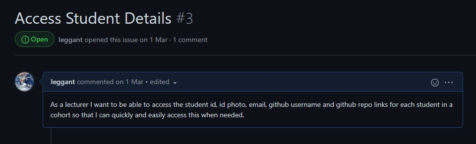  |
| [Group Project Info Issue #6](https://github.com/BIT-Studio-3/group-project-21-1-budget-marvel-avengers/issues/6) | 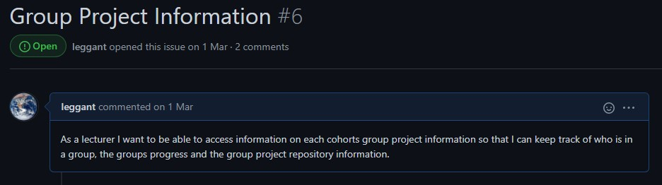  |
| [Assignment Submissions Issue #13](https://github.com/BIT-Studio-3/group-project-21-1-budget-marvel-avengers/issues/13) | 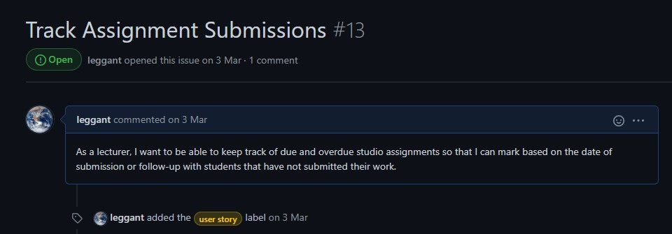 |

- [x] Contribute in a meaningful way to coding and releasing features that meet the user requirements 

  | Details                                                      | Links                                                        |
  | :----------------------------------------------------------- | ------------------------------------------------------------ |
  | Issue around tracking student gender in the application required consultation with the client which was resolved, removed from the model and migration. | [Consultation  with client re student data, gender. Pull request #57](https://github.com/BIT-Studio-3/group-project-21-1-budget-marvel-avengers/pull/57) [Comment #42](https://github.com/BIT-Studio-3/group-project-21-1-budget-marvel-avengers/issues/42#issuecomment-810886923) [Issue #58](https://github.com/BIT-Studio-3/group-project-21-1-budget-marvel-avengers/issues/58) |
  | Code review of pull request 46, HTML code needed restructuring to prevent future errors when making HTTP requests from the form. | [HTML Structure Change-pull request #46](https://github.com/BIT-Studio-3/group-project-21-1-budget-marvel-avengers/pull/46#discussion_r603191832) |
  
- [x] Demonstrate an iterative approach to project work using Design Thinking techniques 

  | Details                                                      | Link/Screenshot                                              |
  | ------------------------------------------------------------ | :----------------------------------------------------------- |
  | Teams channel post from the beginning of the project. I created this  mindmap of ideas on my whiteboard at home and decided to share it with the team to start a conversation about the  project. It is not intended to be used in the project, just a conversation starter -  unfortunately not many people noticed it  so it didn't really work as intended. | 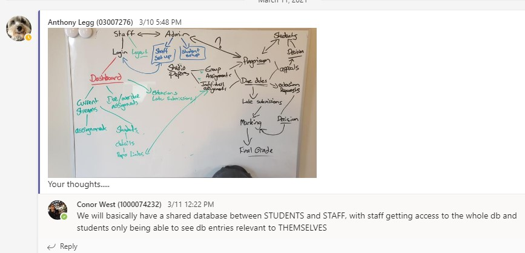 |
  | Progressing on from the earlier mind map,  and the first two sprints, my ideas on how  the database entities could connect in future  got clearer. Although these are purely my  own ideas, could Progression of ideas around how the database relationships could work. Some these are my ideas, things that I have marked out on my whiteboard at home. Although these have been posted on teams there has not | 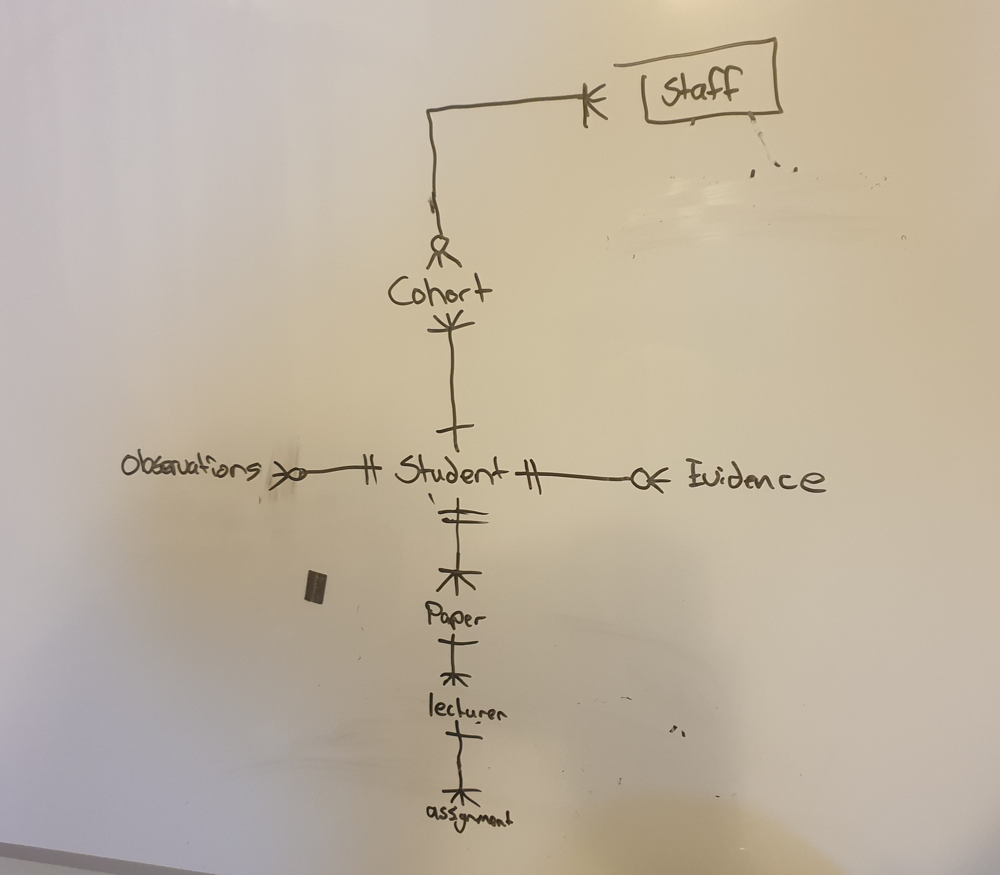           |
  
- [x] Participate in code review to ensure high-quality outputs 

  | Link/Details                                                 |                     Screenshot                      |
  | ------------------------------------------------------------ | :-------------------------------------------------: |
  | [Pull Request 33 Code Review](https://github.com/BIT-Studio-3/group-project-21-1-budget-marvel-avengers/pull/33) Each team member had made a controller for their web page. We moved these to a single pages controller. Also checking folder structure is consistent | 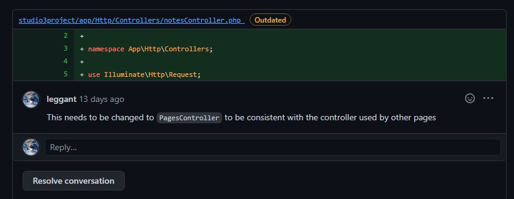 |
  | [Pull Request #46 Code Review](https://github.com/BIT-Studio-3/group-project-21-1-budget-marvel-avengers/pull/46) id attribute incorrectly used in web forms. | 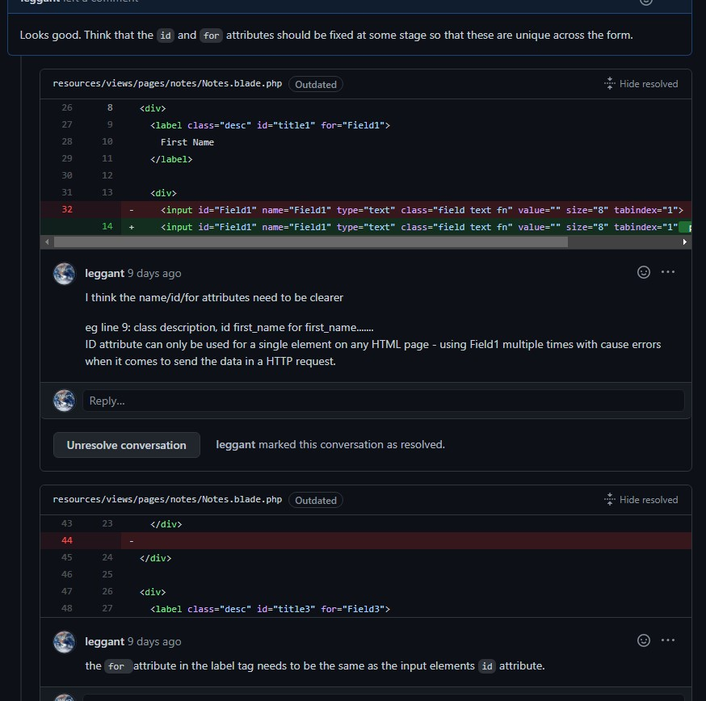 |
  | [Pull Request 57 Code Review](https://github.com/BIT-Studio-3/group-project-21-1-budget-marvel-avengers/pull/57#pullrequestreview-624981556) checking naming conventions used are the same to prevent merge conflicts. | 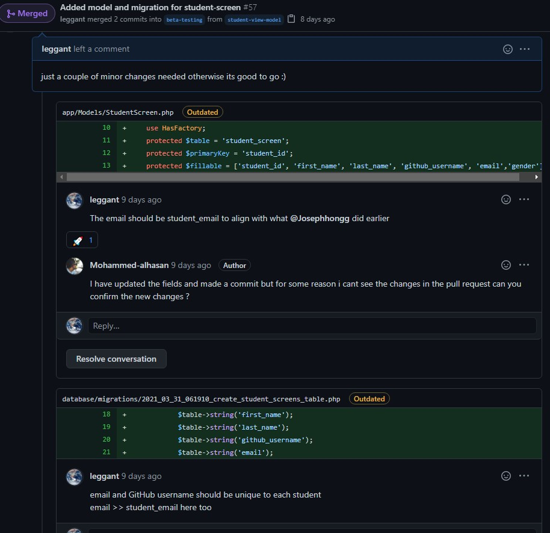 |
  | [Pull Request #75 Code Review](https://github.com/BIT-Studio-3/group-project-21-1-budget-marvel-avengers/pull/75#pullrequestreview-627537426) Code review request to change the   students' id field to a non-incrementing field. | 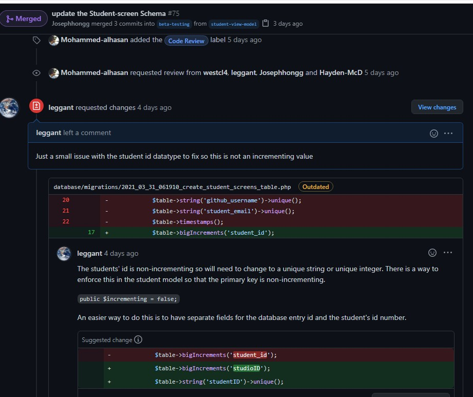 |

# Learning Outcome 2 

>  Employ ethical and sustainable development methodologies and tools in a team environment. 

- [x] Communicate within a team in order to maintain sustainable productivity 

  | Details/Links                                                |                       Screenshot                        |
  | ------------------------------------------------------------ | :-----------------------------------------------------: |
  | Teams channel post -  I noticed from some of the initial commits that we did not have our git settings correctly configured and so I posted some instructions on how to fix this and why it needed addressing. | 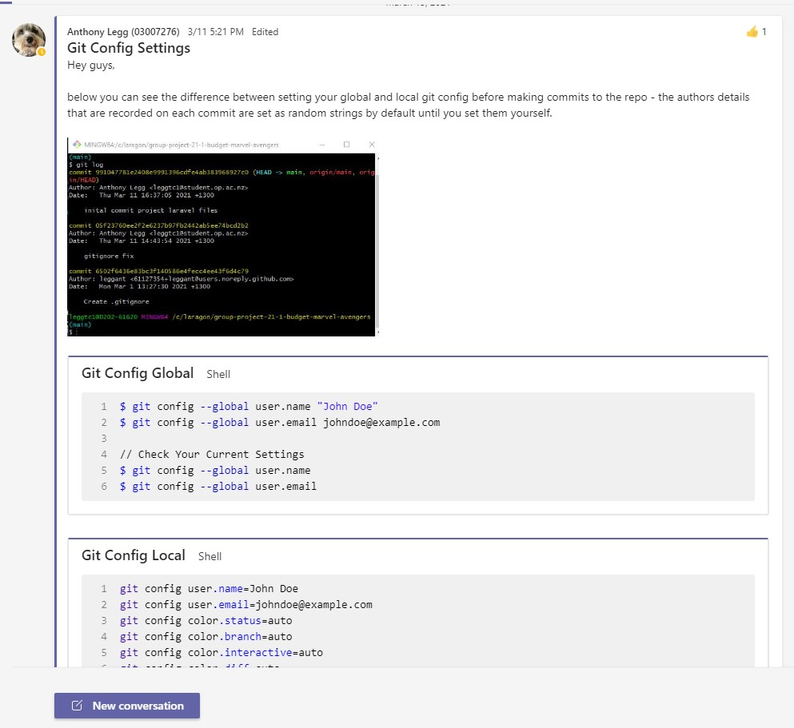 |
  | At the start of the semester I created a channel on Teams for the project to communicate. This has been used for remote meetings, coding sessions and to help each other out with Laravel and GitHub. |            |
  | Created a messenger group at the beginning of the project. Using messenger to communicate and organise in previous projects proved to be more successful than using teams; it has also been more successful in this project due to it being installed on everyones phones, so response to messages is very quick. |  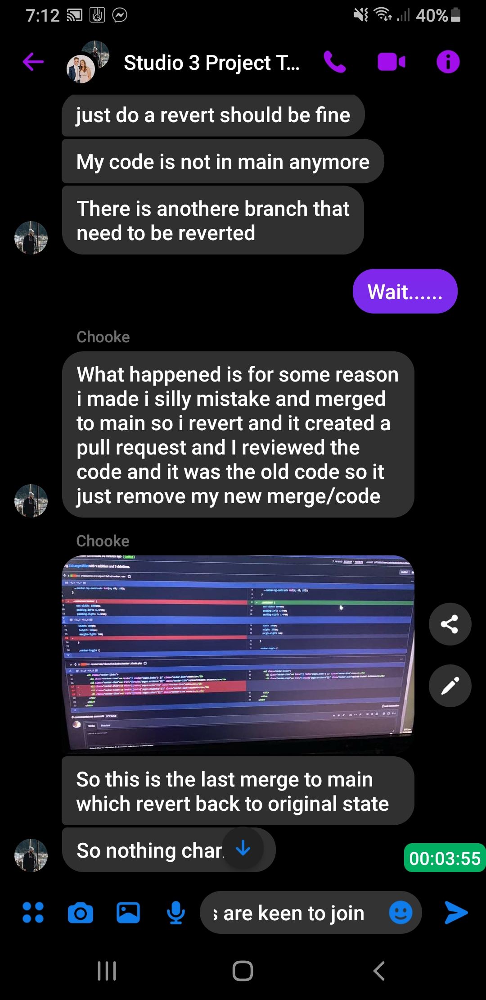  |
  
- [x] Use industry-standard communication and project management tools in a professional manner 

  | Details/Links                                                | Screenshot                                           |
  | ------------------------------------------------------------ | ---------------------------------------------------- |
  | Although this is not very  professionally written, the  intent was to draw the  attention of the team to  this free online tool that would enable us to plan our model relationships. | 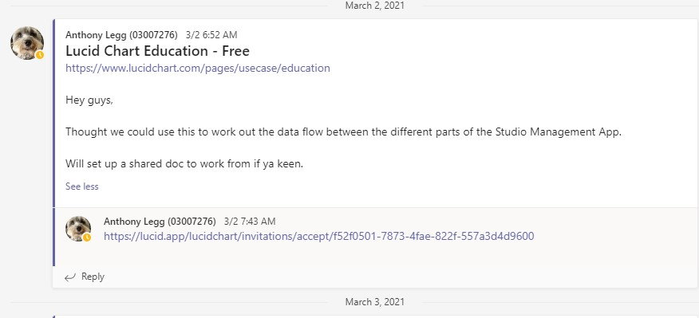 |
  
- [x] Contribute to producing safe, accessible, usable and useful software 

  | Details                                                      |                                           Links/Screenshots |
  | :----------------------------------------------------------- | ----------------------------------------------------------: |
  | [Pull Request #63](https://github.com/BIT-Studio-3/group-project-21-1-budget-marvel-avengers/pull/63#discussion_r605353672)  Suggestion to include some form model  attributes that would allow users to  track studio group projects, group project GitHub repositories. | 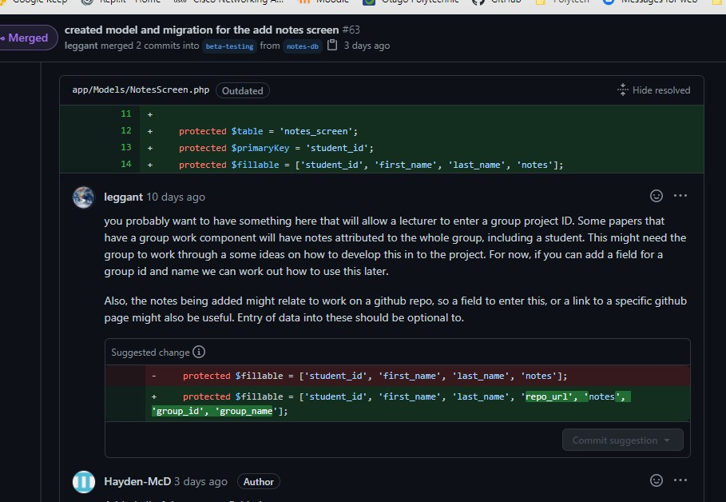 |
  | [Pull Request #33](https://github.com/BIT-Studio-3/group-project-21-1-budget-marvel-avengers/pull/33#discussion_r601972172) Suggestion in code review to include some form  fields that will allow the user to retrospectively  look at cohorts from previous years. |      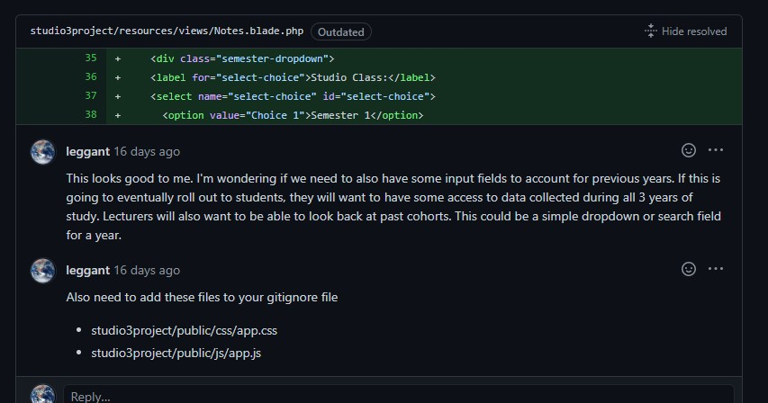 |

- [x] Employ leadership and conflict management techniques to sustain an agreed workflow 

  | Details                                                      | Links/Screenshots                                            |
  | ------------------------------------------------------------ | ------------------------------------------------------------ |
  | Project WIKI Page This has been created as a guide for us to follow file/branch naming conventions, sprint guidelines etc. Everyone is encouraged to contribute to this to help it evolve each sprint. | [Project Wiki](https://github.com/BIT-Studio-3/group-project-21-1-budget-marvel-avengers/wiki) |
  | Sprint Stand-up Meetings These are scheduled for 830pm via teams so that we have everyone present. Usually there is only a few of us, but this still provides a good opportunity for issues to be cleared up. | 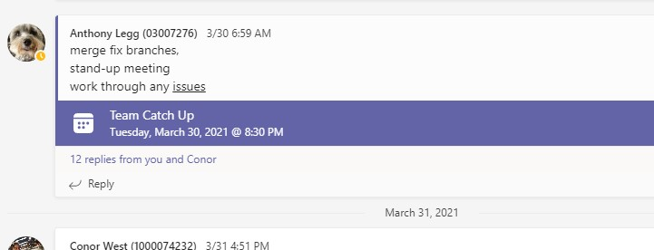                              |

