# Anthony Legg - Studio 4 PDR

[Link To GitHub Repo](https://GitHub.com/BIT-Studio-4/team-project-2021-s2-team-delta)
[Link To Studio 4 Test Website](https://#)
[Link To Studio 4 Production Website](https://bit-studio-management.herokuapp.com/)

## Evidence For Submission

### What are your personal goals and objectives in addition to the course objectives?

My goals are to continue to development, leadership and stress-management skills. I feel that I have only scratched the surface of agile and scrum methodologies.  continues to be a major goal. I think that I have improved in this area from last semester, in that I am more aware of what I am saying and how it is perceived. But there is definitely room for improvement. 

------

###  What has gone well? What are your strengths?

I think  ngths are communication, reliability, empathy and self-motivation. The project team made a number of changes following the first sprint; placing more emphasis on working together and communicating more frequently. Despite the many challenges faced, the core team consistently worked together to overcome them and meet the clients objectives. 

------

### What could have gone better and how?

#### Practice PDR:
It has taken some time for the group to gel together. The first two sprints were particularly challenging because there was a tendency to avoid communicating; pushing to change this and handle the problems that arise because of it has consumed a lot of energy; this has affected my ability to document workflow processes and measure success. Communication of changes in the project need to improve as soon as possible; During the last two sprints, there has not been enough information getting added to some to the pull request, to be transferred to the QA to follow up and adjust the test suite. This disconnect is causing the test suite to be a cause of errors rather than the rest of the project.  This has meant that the last two sprints have not had a functional, reliable test suite. 

#### Final PDR

------

### What are the next steps to take? What is your plan for further self-development?

#### Practice PDR
Next steps are to keep actively engaging the team and pushing for more collaboration to occur. Had more of this been happening, the issues identified in sprint 1 could have been solved in sprint  2 rather than continuing into sprint 3 and possibly sprint 4. I feel that I need to take a step back from development of the code base, so that I can put more work into the product backlog, workflow processes and project automation. I am really keen to push the project automation, particularly with the GitHub and the management of deployments; Have access to a deployment monitoring application called [Sentry](https://docs.sentry.io/) which I would like to implement in the repo to monitor and alert us to issues. As student, we have free access to this service. Similar options are available, such as [CircleCI](https://circleci.com/), but these have very limited education plans.

I would like to learn how to measure success, what the definition of success is, how to efficiently track  progress so that the group can use this to build on.

#### Final PDR:

------

### What barriers exist? How do you plan to deal with them?

Communication is the number one barrier right now. Getting buy-in from everyone in the group has been a massive challenge. I hate being demanding, but I feel like if I'm not, then we all lose. I think getting more documentation on record will help us to not lose track during upcoming sprints.

Getting accurate information from the group is still difficult. For example, just this last week, we all approved code that was clearly broken, but was completely untested. This was in large part because we are all struggling to keep up with the workload, particularly during this lockdown. This was picked up a day or so later in the test deployment. This was a pretty big indication that there are issues with our current workflow, that don't work when we are under pressure.

From an automation perspective, I hope to make the dusk test GitHub action a requirement for every pull request to pass on both the staging and master branches. This can be done when sprint 3 code is merged to master. Having this in place will force the team pay attention when tests fail, something that we haven't had until now. As mentioned, I would like to get approval to install [Sentry](https://docs.sentry.io/) to the repo. A request for this was sent via email on the 4th September. This will provide status updates on deployments. 

I would like to work on configuring Heroku's review app feature, this will test every pull request, by automatically deploying it to a temporary test environment and feed back the success or failure of the run. 

------

### What is not clear or is uncertain?

I'm not sure that I am doing what I need to be doing or what changes I need to put in place to ensure that the requirements for the project and the semester are met and there is sufficient evidence to prove it. Also, I have no idea who to listen to when it comes to the project backlog. Information is inconsistent and confusing, not just to me but also the others. 

# Learning Outcome 1

>  Select and apply industry-standard tools and processes to solve non-trivial problems in a team environment.

## 1.1 Contribute to development of new product features

1. [Pull Request #109 - Update To Jetstream Template](https://github.com/BIT-Studio-4/team-project-2021-s2-team-delta/pull/109)

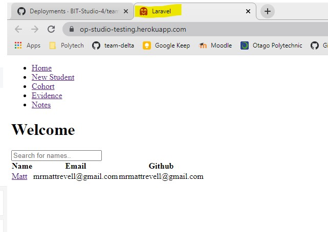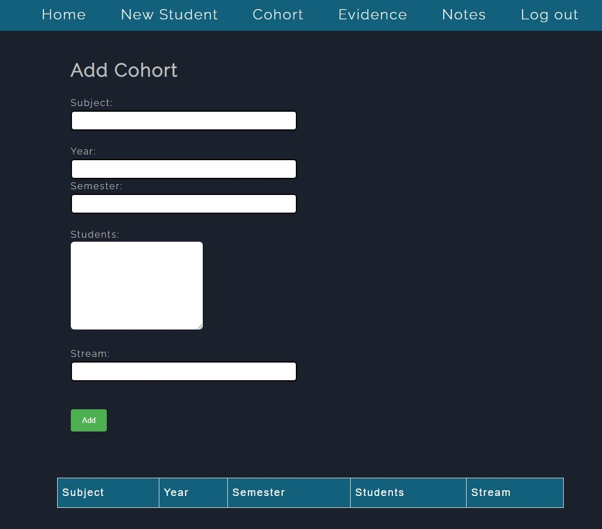
 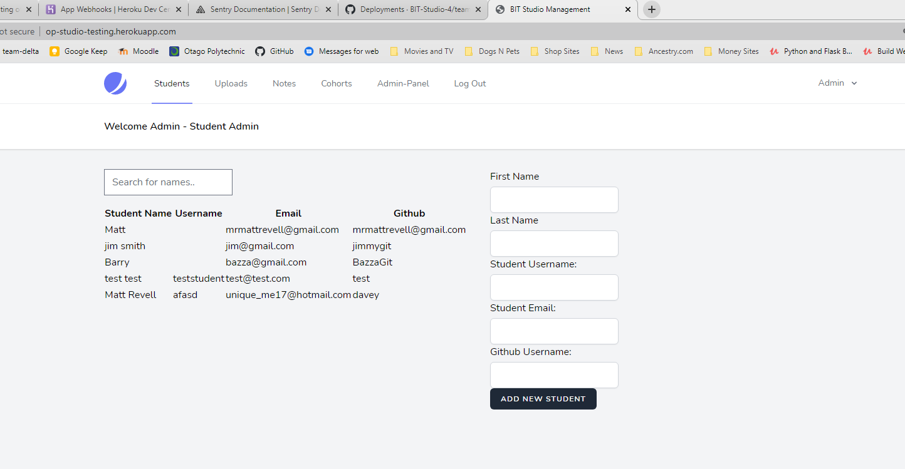

## 1.2 Contribute to Project Deployment

1. Set-Up the pipeline configuration on Heroku, linked this back to the repo at the start of the semester
   - Added the team as members
   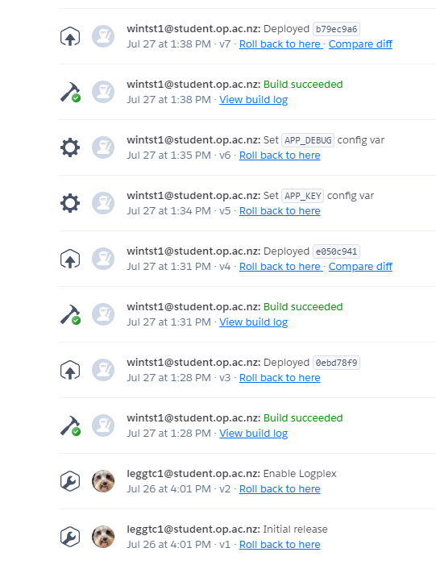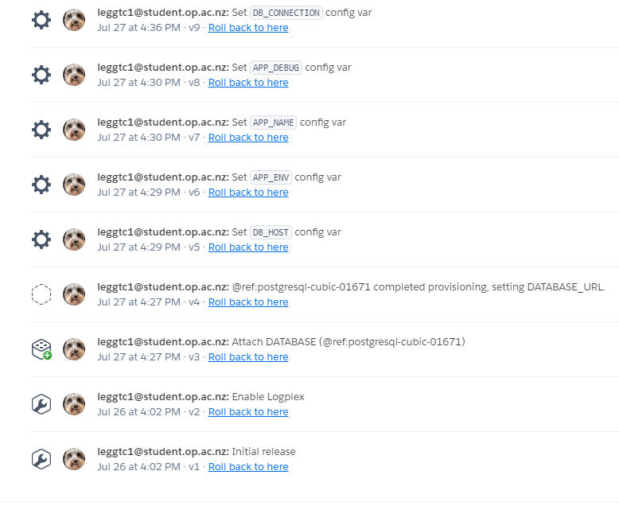
2. I have been testing a script to run deployments automatically each time a merge is added to the staging or master branch, this would have the added advantage of running migrations automatically for each deployment from staging and master branches. Currently this needs to be done manually.
   - success status updates are returned to both GitHub and Teams via a webhook
3. I made a failed attempt at setting up the review app for testing purposes, the artefacts' from this are still present in the repo, I would like to get this set up and working correctly in the next sprint.
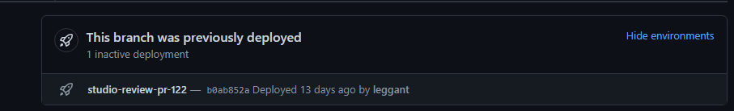
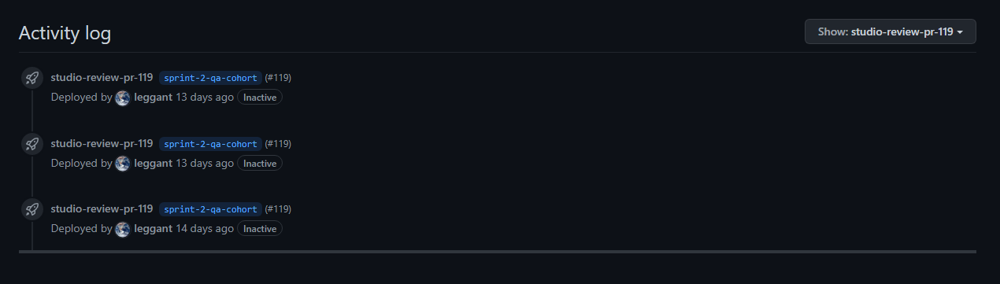

- [Issue #104 - GitHub Action - Check Deployment](https://github.com/BIT-Studio-4/team-project-2021-s2-team-delta/issues/104)
- [Issue #121 - Sprint 2 GitHub Deployment Actions](https://github.com/BIT-Studio-4/team-project-2021-s2-team-delta/pull/121)
- [Issue #152 - Monitoring Deployment](https://github.com/BIT-Studio-4/team-project-2021-s2-team-delta/issues/152)

------

## 1.3  Contribute to CI/CD solution

- Configured the GitHub Dusk testing action
  - Work began on this in sprint 1 - is now ready to be deployed as a guard on the master and staging branches
  - also configured changes in the Laravel app settings which were preventing the Dusk test working on GitHub
  - [Pull Request #57 - Sprint 1](https://github.com/BIT-Studio-4/team-project-2021-s2-team-delta/pull/57)
  - [Pull Request #121 - Sprint 2](https://github.com/BIT-Studio-4/team-project-2021-s2-team-delta/pull/121)
  - [Pull Request #144 - Sprint 3](https://github.com/BIT-Studio-4/team-project-2021-s2-team-delta/pull/144)

- configured linter check GitHub action, set this so it prevents code that does not meet the standard from getting merged into the master or the staging branches.
  - At the same time I added a prettier script to run through the whole project, and fix issues with spacing and messy code blocks. 
  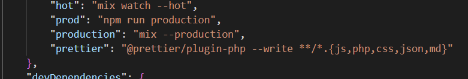

------

## 1.4 Demonstrate improvements in applying Agile project management

- Set goals for each sprint, shared on both the [sprint project board](https://github.com/BIT-Studio-4/team-project-2021-s2-team-delta/projects) and on [milestones](https://github.com/BIT-Studio-4/team-project-2021-s2-team-delta/milestones)

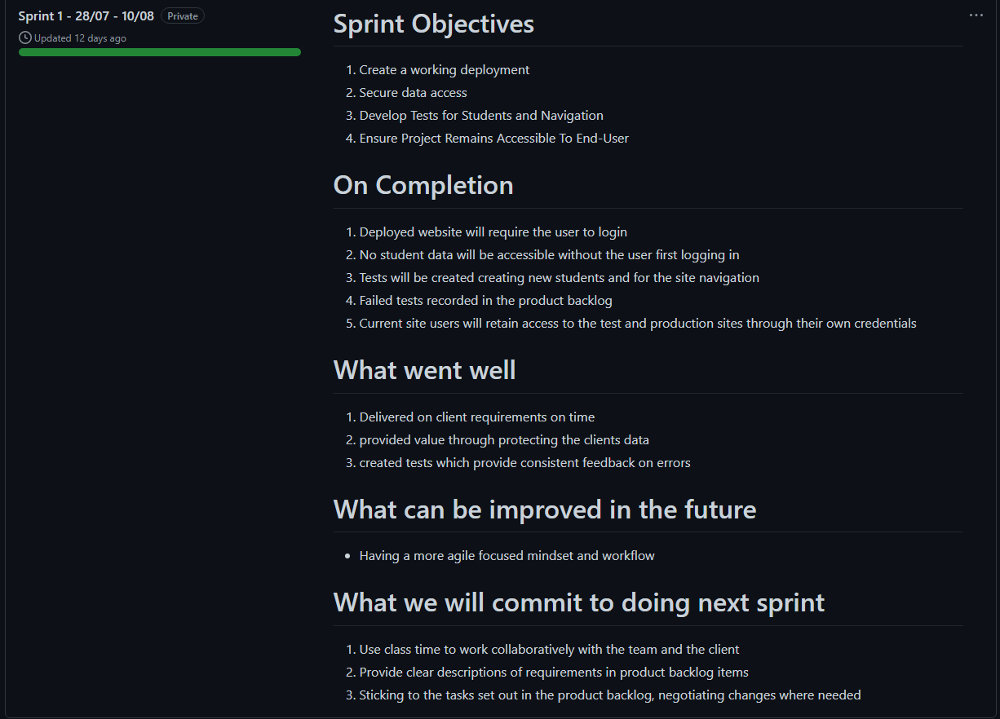
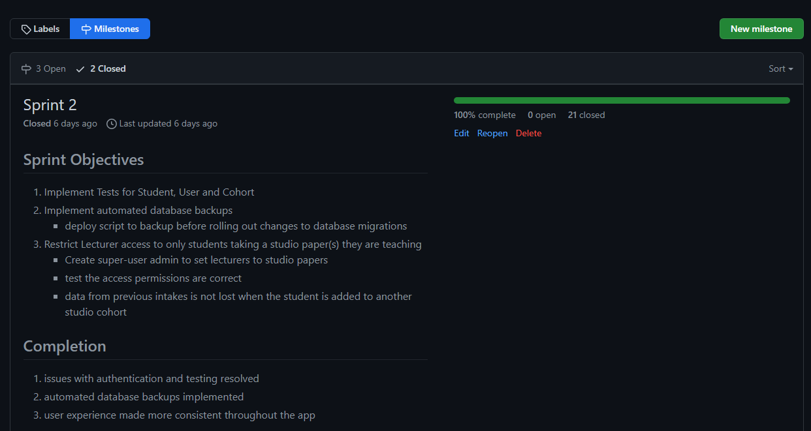

- Respond to changes/issues
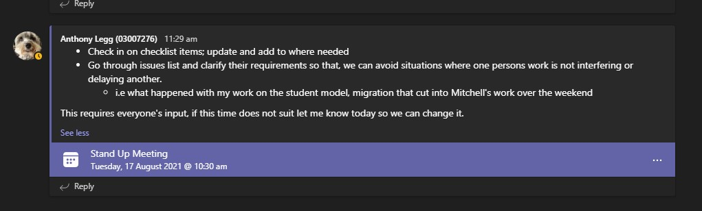

- Consistent engagement via Teams, stand up meetings
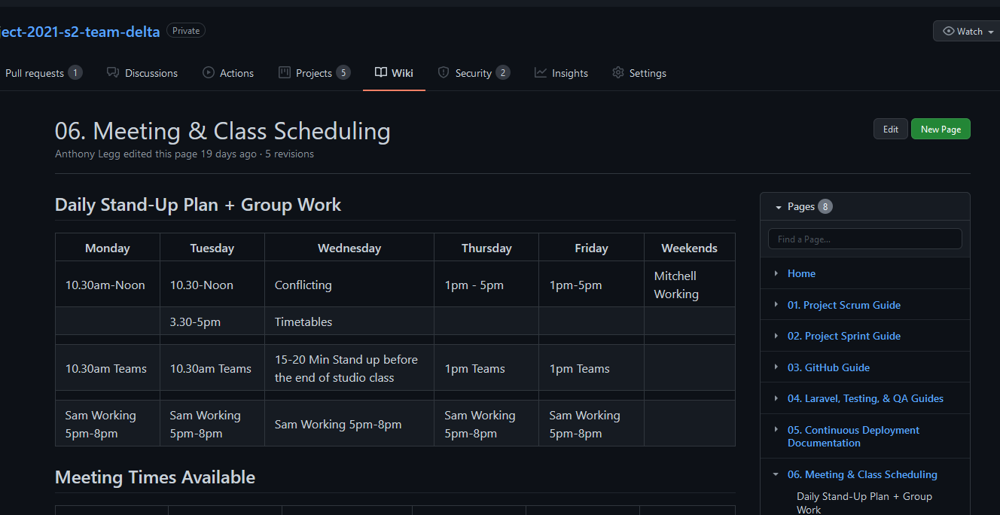
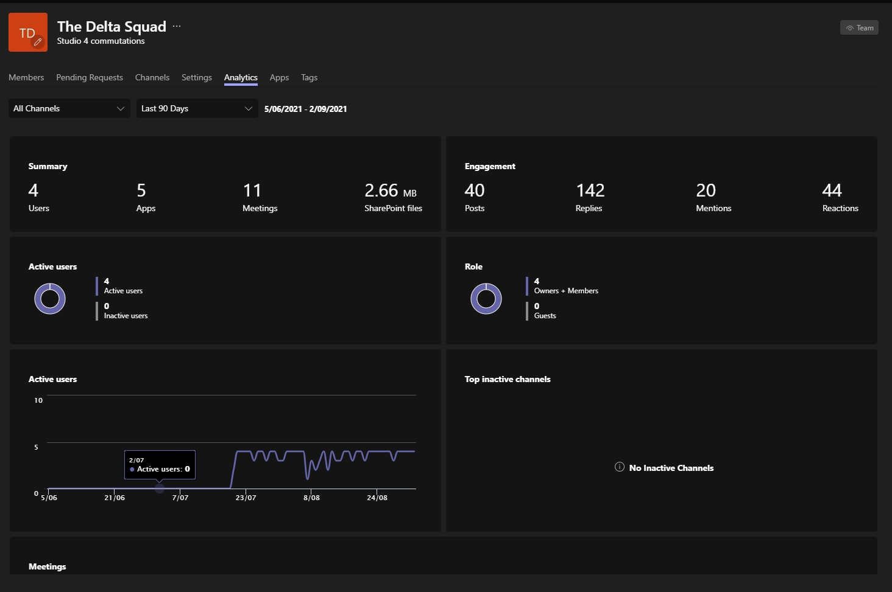
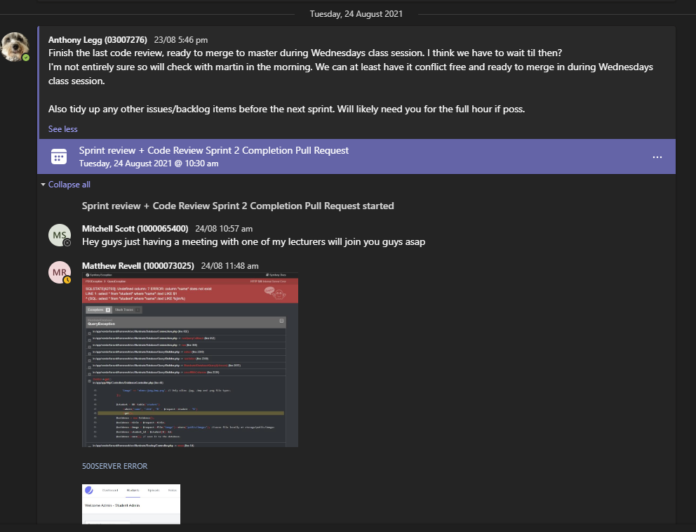
- [Improved Product Backlog Information](https://github.com/BIT-Studio-4/team-project-2021-s2-team-delta/issues/132)
  - We are adapting the backlog so that each item in a sprint has user stories, definition of the issue, potential solutions, task list of steps needed.
- [Project Discussion Pages](https://github.com/BIT-Studio-4/team-project-2021-s2-team-delta/discussions)
  - to communicate, share ideas and [resources](https://github.com/BIT-Studio-4/team-project-2021-s2-team-delta/discussions/4)
  - [get feedback on project workflow](https://github.com/BIT-Studio-4/team-project-2021-s2-team-delta/discussions/150) improvements - (or, I am hoping to in this case)
  - Transfer [items to the wiki](https://github.com/BIT-Studio-4/team-project-2021-s2-team-delta/discussions/62)

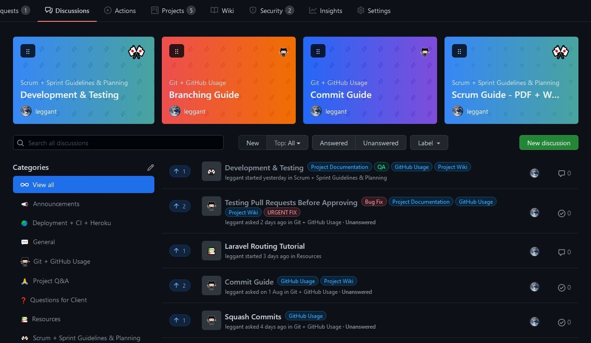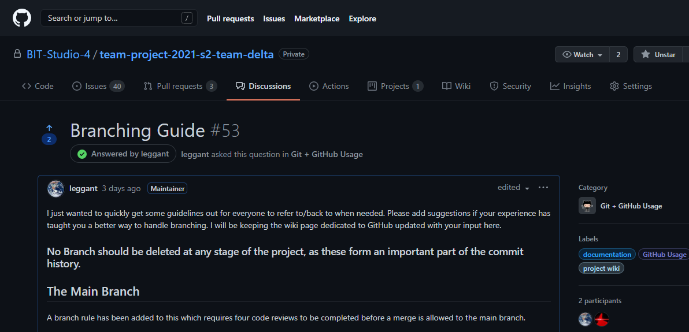

- [Project Wiki](https://github.com/BIT-Studio-4/team-project-2021-s2-team-delta/wiki)
  - [Stand up Meeting Plan](https://github.com/BIT-Studio-4/team-project-2021-s2-team-delta/wiki/06.-Meeting-&-Class-Scheduling)
  - [GitHub Guide](https://github.com/BIT-Studio-4/team-project-2021-s2-team-delta/wiki/03.-GitHub-Guide) - Has been Neglected 
  - [Project Scrum Guide](https://github.com/BIT-Studio-4/team-project-2021-s2-team-delta/wiki/01.-Project-Scrum-Guide) - Needs to be updated
  - [Project Sprint Plan](https://github.com/BIT-Studio-4/team-project-2021-s2-team-delta/wiki/02.-Project-Sprint-Guide) - Also needs to be completed.

### Failed: Addition of [Issue Forms](https://github.com/BIT-Studio-4/team-project-2021-s2-team-delta/pull/121) Incompatible With Private Repositories

In sprint two, I developed a couple of issue form templates ([Form 1](https://user-images.githubusercontent.com/61127354/130374336-20e1b5df-d130-45a2-b7a2-98b84ea9f15b.png) + [Form 2](https://user-images.githubusercontent.com/61127354/130374356-a437e5d6-cafc-419a-a72e-7fc1f6011e96.png)) in a separate repo to standardise the information getting added to the issues/product backlog, and encourage everyone to provide more detailed information that would help to scope each sprint. I was unaware until it was deployed to the repos master branch that forms are not allowed in private repositories. I have included the pull request here to show that I have made an attempt to ensure that information getting added to the back log was consistent moving forward.

------

## 1.5 Use industry-standard communication and project management tools in a professional manner

### [Meeting Summaries - Discussion Board](https://github.com/BIT-Studio-4/team-project-2021-s2-team-delta/discussions/83)

### Teams Channel - Stand Up Meetings

These are now occuring daily, usually on Teams.

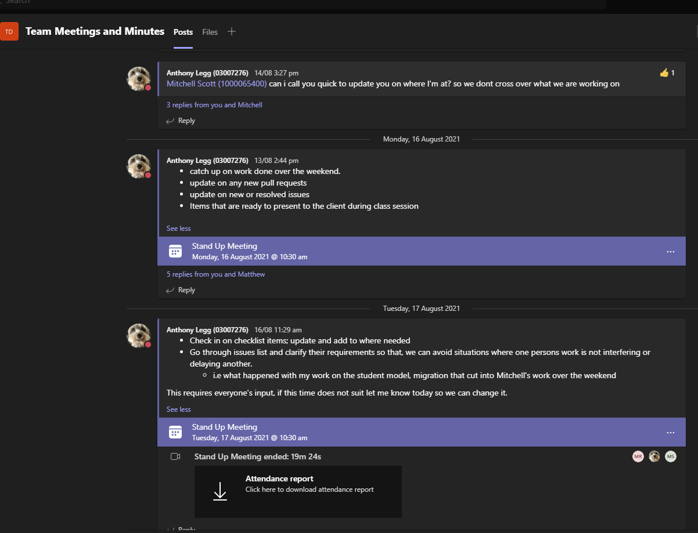
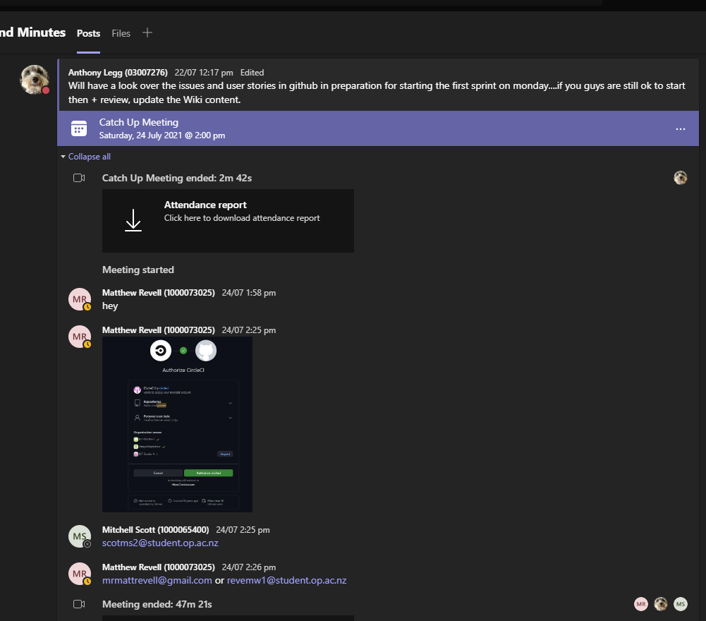

# Learning Outcome 2

>  Analyse and manage development challenges to create production-quality outputs.

## 2.1 Contribute to automated test suite

Have developed 2 fully functional tests so far.

1. [Sprint 1 - sprint-1-laravel-deployment-testing](https://github.com/BIT-Studio-4/team-project-2021-s2-team-delta/commits/sprint-1-laravel-deployment-testing)
2. [Sprint 2 - sprint-2-github-deployment-actions](https://github.com/BIT-Studio-4/team-project-2021-s2-team-delta/commits/sprint-2-github-deployment-actions)
3. [Sprint 3 - sprint-3-github-dusk-action](https://github.com/BIT-Studio-4/team-project-2021-s2-team-delta/commits/sprint-3-github-dusk-action)

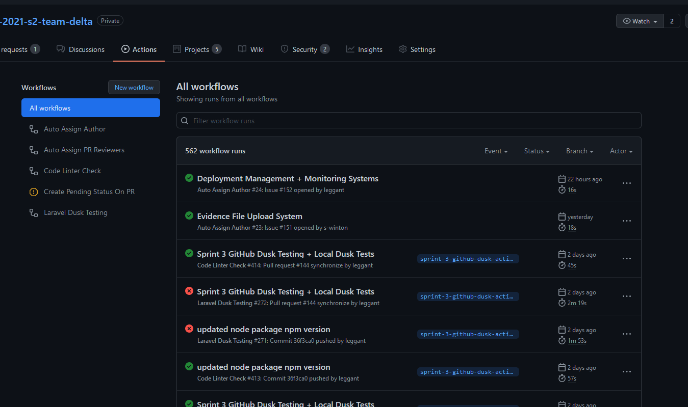

## 2.2 Perform a security audit to identify potential vulnerabilities

I set up Dependabot Alerts on GitHub last week, did not know this was something available to us. Writing this reminded me to add the others to get this alert. There is an alert up on there now. I'm not sure what to do with it, there is an option to automatically fix it. But this might add new issues, so I have left that off.

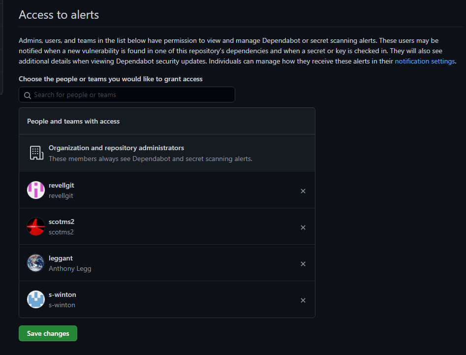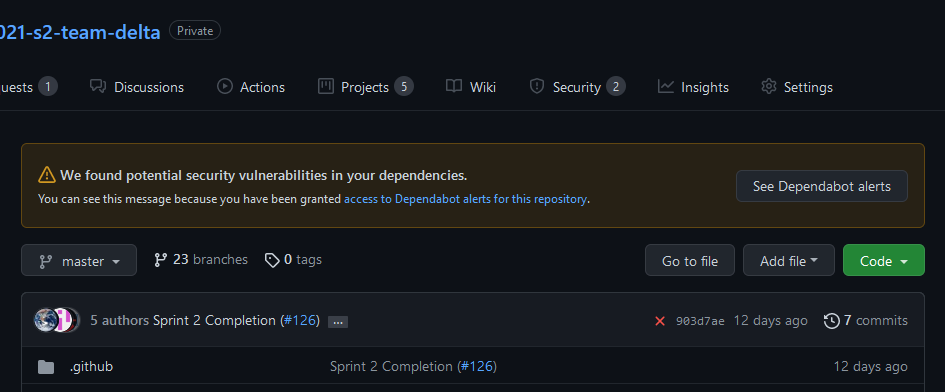

## 2.3 [Participate in code/solution review](https://github.com/BIT-Studio-4/team-project-2021-s2-team-delta/pulls?q=is%3Apr+reviewed-by%3A%40me+is%3Aclosed) to ensure high-quality outputs

1. [Pull Request #159 - Sprint 3](https://github.com/BIT-Studio-4/team-project-2021-s2-team-delta/pull/159#pullrequestreview-747746104)
2. [Pull Request #75 - Sprint 1](https://github.com/BIT-Studio-4/team-project-2021-s2-team-delta/pull/75#pullrequestreview-720604349)
3. [Pull Request #81 - Sprint 1](https://github.com/BIT-Studio-4/team-project-2021-s2-team-delta/pull/81#pullrequestreview-722997738)
4. [Pull Request #88](https://github.com/BIT-Studio-4/team-project-2021-s2-team-delta/pull/88)
    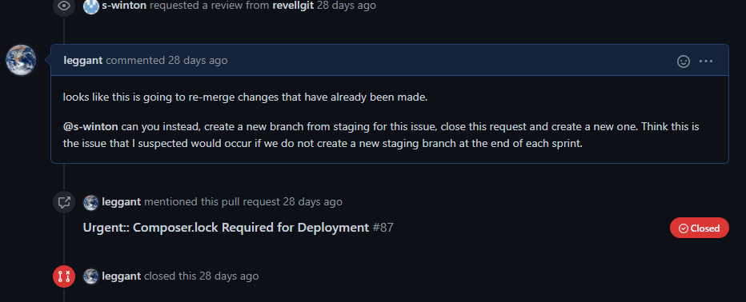
5. [Pull Request #106](https://github.com/BIT-Studio-4/team-project-2021-s2-team-delta/pull/106)
6. [Pull Request #134 - Review 1](https://github.com/BIT-Studio-4/team-project-2021-s2-team-delta/pull/134#pullrequestreview-741151610) [+ Review 2](https://github.com/BIT-Studio-4/team-project-2021-s2-team-delta/pull/134#pullrequestreview-741254586)
7. [Pull Request #164 - Sprint 3](https://github.com/BIT-Studio-4/team-project-2021-s2-team-delta/pull/164)
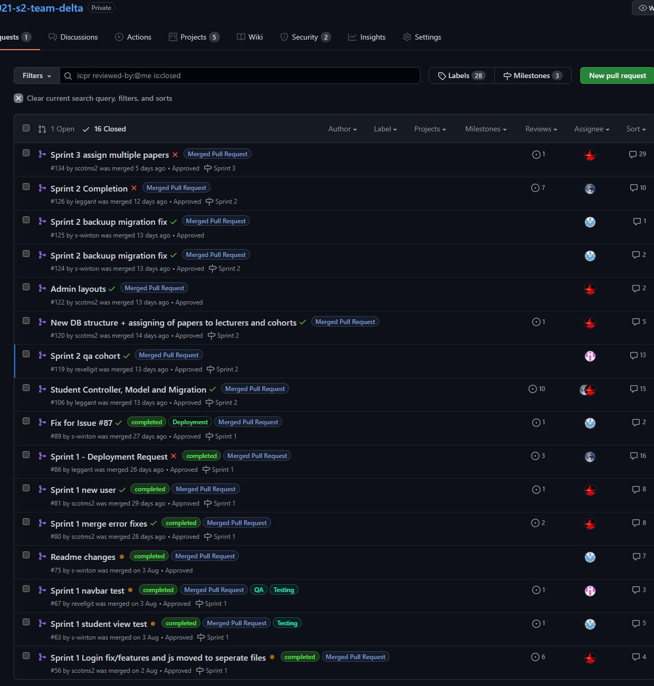