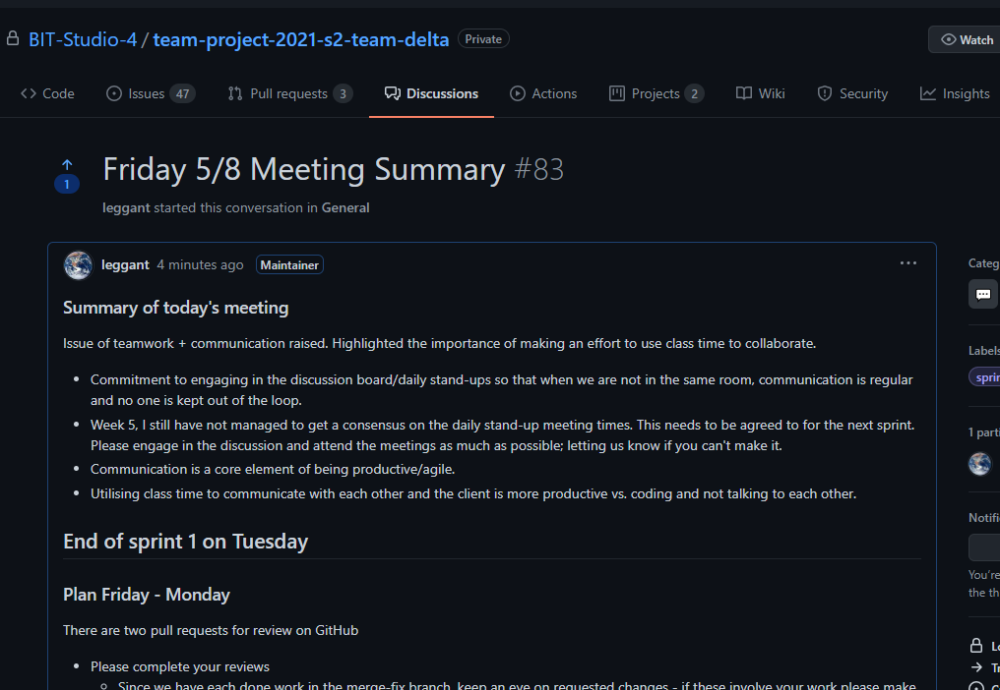

# Anthony Legg - Studio 4 PDR

[Link To GitHub Repo](https://GitHub.com/BIT-Studio-4/team-project-2021-s2-team-delta)
[Link To Studio 4 Test Website - add the link](https://#) 
[Link To Studio 4 Production Website](https://bit-studio-management.herokuapp.com/)

---

## Evidence For Submission

### What are your personal goals and objectives in addition to the course objectives?

Development of communication, leadership and stress-management skills continues to be a major goal. I think that I have improved in this area from last semester, in that I am more aware of what I am saying and how it is perceived. But there is definitely room for improvement. 

I need to take let go more and take things much less personally. Working as part of a group is challenging; everyone has their way of doing things, my goal is to be more patient

Try are to continue to development, leadership and stress-management skills. I feel that I have only scratched the surface of agile and scrum methodologies.

I think that I have improved in this area from last semester, in that I am more aware of what I am saying and how it is perceived. But there is definitely room for improvement. 

------

###  What has gone well? What are your strengths?

As a team we were able to improve all aspects of the project that we started with. The site has been made more secure, is presented more consistently across all pages, and provides the client with a system more in line with the clients needs. 
The most important thing is to deliver on the goals of the client; I think that ultimately we delivered on most of these objectives  through regular team communication, and I think I times this has not b.
I think my strengths are honest communication, reliability, empathy and self-motivation. 

------

### What could have gone better and how?

Throughout the project, a big recurring issue arose out of team members working in isolation; and not honestly communicating with the rest of the team how they were progressing. It has taken some time for the group to gel together. The first two sprints were particularly challenging because there was a tendency to avoid communicating; pushing to change this and handle the problems that arise because of it has consumed a lot of energy; this has affected my ability to document workflow processes and measure success. Communication of changes in the project need to improve as soon as possible; 

During the last two sprints, there has not been enough information getting added to some to the pull request, to be transferred to the QA to follow up and adjust the test suite. This disconnect is causing the test suite to be a cause of errors rather than the rest of the project.  This has meant that the last two sprints have not had a functional, reliable test suite. ~

Test suite issues - resolved through using containers and testing the code in isolation.
Work flow issues - resolved through frquently working in person rather than remotely.

------

### What are the next steps to take? What is your plan for further self-development?

Next steps are to keep actively engaging the team and pushing for more collaboration to occur. Had more of this been happening, the issues identified in sprint 1 could have been solved in sprint  2 rather than continuing into sprint 3 and possibly sprint 4. I feel that I need to take a step back from development of the code base, so that I can put more work into the product backlog, workflow processes and project automation. I am really keen to push the project automation, particularly with the GitHub and the management of deployments; Have access to a deployment monitoring application.

------

### What barriers exist? How do you plan to deal with them?

Communication is the number one barrier right now. Getting buy-in from everyone in the group has been a massive challenge. I hate being demanding, but I feel like if I'm not, then we all lose. I think getting more documentation on record will help us to not lose track during upcoming sprints.

Getting accurate information from the group is still difficult. For example, just this last week, we all approved code that was clearly broken, but was completely untested. This was in large part because we are all struggling to keep up with the workload, particularly during this lockdown. This was picked up a day or so later in the test deployment. This was a pretty big indication that there are issues with our current workflow, that don't work when we are under pressure.

From an automation perspective, I hope to make the dusk test GitHub action a requirement for every pull request to pass on both the staging and master branches. This can be done when sprint 3 code is merged to master. Having this in place will force the team pay attention when tests fail, something that we haven't had until now. As mentioned, I would like to get approval to install [Sentry](https://docs.sentry.io/) to the repo. A request for this was sent via email on the 4th September. This will provide status updates on deployments. 

I would like to work on configuring Heroku's review app feature, this will test every pull request, by automatically deploying it to a temporary test environment and feed back the success or failure of the run. 

------

### What is not clear or is uncertain?

I'm not sure that I am doing what I need to be doing or what changes I need to put in place to ensure that the requirements for the project and the semester are met and there is sufficient evidence to prove it. Also, I have no idea who to listen to when it comes to the project backlog. Information is inconsistent and confusing, not just to me but also the others. 

# Learning Outcome 1

>  Select and apply industry-standard tools and processes to solve non-trivial problems in a team environment.

## 1.1 Contribute to development of new product features

1. [Pull Request #109 - Update To Jetstream Template](https://github.com/BIT-Studio-4/team-project-2021-s2-team-delta/pull/109)
2. [Issue #127 - Student Evidence Uploads](https://github.com/BIT-Studio-4/team-project-2021-s2-team-delta/issues/127)
3. [Issue #139 - Student Status](https://github.com/BIT-Studio-4/team-project-2021-s2-team-delta/issues/139)
4. [Pull Request - Sprint 3 sprint-3-deployment-fix](https://github.com/BIT-Studio-4/team-project-2021-s2-team-delta/pull/161)
5. [Pull Request #198 - Sprint 4 - Admin + Lecturer Access Permissions](https://github.com/BIT-Studio-4/team-project-2021-s2-team-delta/pull/198#issuecomment-930517302)

### Front End Development

The developer role was Mitchell's primary role; he needed to be able to concentrate securing the app, refactoring the original apps configuration, and creating administrator/lecturer permissions. For this to occur Through out the project, I made significant contributions to the UI design/layout. 

 and creating the admin/lecturer  that would provide the user a  was to create the UI and layout of the website. I was responsible for the styling of the website, and the layout of the website. I also worked on the UI of the website, and the styling of the website. 

## 1.2 Contribute to Project Deployment

1. Set-Up the pipeline configuration on Heroku, linked this back to the repo at the start of the semester
  - Added the team as members
  - Set up the database on the Heroku production app
      
2. Configured, tested release script and Procfile to run migrations automatically on both Heroku servers. This previously needed to be done manually each time a pull request was merged to the staging and master branches.
- [Issue #104 - GitHub Action - Check Deployment](https://github.com/BIT-Studio-4/team-project-2021-s2-team-delta/issues/104)
- [Issue #121 - Sprint 2 GitHub Deployment Actions](https://github.com/BIT-Studio-4/team-project-2021-s2-team-delta/pull/121)
- [Issue #152 - Monitoring Deployment](https://github.com/BIT-Studio-4/team-project-2021-s2-team-delta/issues/152)
- [PR #164 - sprint-3-deployment-fix](https://github.com/BIT-Studio-4/team-project-2021-s2-team-delta/pull/164)
- [PR #168 - sprint-3-deployment-fix](https://github.com/BIT-Studio-4/team-project-2021-s2-team-delta/pull/168)

------

## 1.3  Contribute to CI/CD solution

- Configured the GitHub Dusk Test Action + Set it as a requirement for any future sprints (Sprint 5)
  - Work began on this in sprint 1 - is now ready to be deployed as a guard on the master and staging branches
  - also configured changes in the Laravel app settings which were preventing the Dusk test working on GitHub
  - [Pull Request #57 - Sprint 1](https://github.com/BIT-Studio-4/team-project-2021-s2-team-delta/pull/57)
  - [Pull Request #121 - Sprint 2](https://github.com/BIT-Studio-4/team-project-2021-s2-team-delta/pull/121)
  - [Pull Request #144 - Sprint 3](https://github.com/BIT-Studio-4/team-project-2021-s2-team-delta/pull/144)
- configured node git commit linter, provided guide for others to adopt its use. This was to standardise commit messages, while prompting everyone to provide more robust commit messages that help to make the repo changelog and release log more informative.
  - (enter url here)
  - (add image)
- configured linter check GitHub action, set this so it prevents code that does not meet the standard from getting merged into the master or the staging branches.
  - At the same time I added a prettier script to run through the whole project, and fix issues with spacing and messy code blocks. 
  
- Configured test app http response action
- Configured production app http response action
- Configured Pull Request Reminder action - this sends a reminder to any team member that has a code review to be completed via our Team channel.

------

## 1.4 Demonstrate Improvements in Applying Agile Project Management

- Set goals for each sprint, shared on both the [sprint project board](https://github.com/BIT-Studio-4/team-project-2021-s2-team-delta/projects) and on [milestones](https://github.com/BIT-Studio-4/team-project-2021-s2-team-delta/milestones)

- Respond to changes/issues

- Consistent engagement via Teams, stand up meetings

- [Improved Product Backlog Information](https://github.com/BIT-Studio-4/team-project-2021-s2-team-delta/issues/132)
  - We are adapting the backlog so that each item in a sprint has user stories, definition of the issue, potential solutions, task list of steps needed.
- [Project Discussion Pages](https://github.com/BIT-Studio-4/team-project-2021-s2-team-delta/discussions)
  - to communicate, share ideas and [resources](https://github.com/BIT-Studio-4/team-project-2021-s2-team-delta/discussions/4)
  - [get feedback on project workflow](https://github.com/BIT-Studio-4/team-project-2021-s2-team-delta/discussions/150) improvements - (or, I am hoping to in this case)
  - Transfer [items to the wiki](https://github.com/BIT-Studio-4/team-project-2021-s2-team-delta/discussions/62)

- [Project Wiki](https://github.com/BIT-Studio-4/team-project-2021-s2-team-delta/wiki)
  - [Stand up Meeting Plan](https://github.com/BIT-Studio-4/team-project-2021-s2-team-delta/wiki/06.-Meeting-&-Class-Scheduling)
  - [GitHub Guide](https://github.com/BIT-Studio-4/team-project-2021-s2-team-delta/wiki/03.-GitHub-Guide)
  - [Project Scrum Guide](https://github.com/BIT-Studio-4/team-project-2021-s2-team-delta/wiki/01.-Project-Scrum-Guide) - Needs to be updated
  - [Project Sprint Plan](https://github.com/BIT-Studio-4/team-project-2021-s2-team-delta/wiki/02.-Project-Sprint-Guide) - Also needs to be completed.
  https://github.com/BIT-Studio-4/team-project-2021-s2-team-delta/discussions/217
------

## 1.5 Use industry-standard communication and project management tools in a professional manner

### [GitHub Discussion Board](https://github.com/BIT-Studio-4/team-project-2021-s2-team-delta/discussions/83)

1. GitHub Wiki

2. Repo Changelog

3. Project Releases

4. Teams Channel - Stand Up Meetings
These are now occurring daily, usually on Teams.

# Learning Outcome 2

>  Analyse and manage development challenges to create production-quality outputs.
***Improve the quality of the project (two or more of the following)***

## Contribute to Automated Test Suite

Sprints 1-3 I worked to get the GitHub automated test suite to work. This was up and running at the end of sprint 3. But was not able to be reliably used until sprint 5 when the tests themselves had their own errors resolved. The automated test suite is now set as a branch rule/guard on production and staging branches.
1. [Sprint 1 PR #57 - sprint-1-laravel-deployment-testing](https://github.com/BIT-Studio-4/team-project-2021-s2-team-delta/pull/57)
2. [Sprint 2 PR #121 - sprint-2-github-deployment-actions](https://github.com/BIT-Studio-4/team-project-2021-s2-team-delta/pull/121)
3. [Sprint 3 PR #144 - sprint-3-github-dusk-action](https://github.com/BIT-Studio-4/team-project-2021-s2-team-delta/pull/144)
4. [Sprint 3 - sprint-3-qa-students-evidence](https://github.com/BIT-Studio-4/team-project-2021-s2-team-delta/pulls?page=1&q=is%3Apr+is%3Aclosed+reviewed-by%3A%40me#pullrequestreview-744519906) Unfortunately Matt did not keep the [code I added in PR 144](https://github.com/BIT-Studio-4/team-project-2021-s2-team-delta/pull/144) which meant there was no working dusk testing available through to the end of the final sprint. 
5. [Sprint 4 - Auto Changelog Script](https://github.com/BIT-Studio-4/team-project-2021-s2-team-delta/pull/191) was implemented in response to 

## Contribute to Project Security

- [Performed a security audit to identify potential vulnerabilities](https://github.com/BIT-Studio-4/team-project-2021-s2-team-delta/discussions/194)
- [Code Review - private keys published to repo](https://github.com/BIT-Studio-4/team-project-2021-s2-team-delta/pull/211#issuecomment-930753339)

## Contribution to Project Automation (CI/CD)

1. Configured the dusk test action, set this as a branch rule/guard on production and staging branches.
2. Automated assignment of pull request reviewers and assignees
3. Configured automated project kanban board - created a template version that could be copied for each sprint.
4. Configured GitHub Action to send reminders to PR reviewers if there are reviews that have not been completed. This is configured to send reminders via the project's teams channel. 
5. Composer automated security check actions. Set this as a branch rule/guard on production and staging branches.
6. Configured automated code linter check action. Set this as a branch rule/guard on production and staging branches.
7. Configured `Prettier` formatter, to scan and format project code locally. This included writing and testing the [configuration](https://github.com/BIT-Studio-4/team-project-2021-s2-team-delta/blob/staging/.prettierrc) and [ignore files](https://github.com/BIT-Studio-4/team-project-2021-s2-team-delta/blob/development/.prettierignore) to ensure this automation did not format any code that was not written by the project team.
8. Configured 

## [Participate in Code/Solution Review](https://github.com/BIT-Studio-4/team-project-2021-s2-team-delta/pulls?q=is%3Apr+reviewed-by%3A%40me+is%3Aclosed) to Ensure High-Quality Outputs

1. [Pull Request #159 - Sprint 3](https://github.com/BIT-Studio-4/team-project-2021-s2-team-delta/pull/159#pullrequestreview-747746104)
2. [Pull Request #75 - Sprint 1](https://github.com/BIT-Studio-4/team-project-2021-s2-team-delta/pull/75#pullrequestreview-720604349)
3. [Pull Request #81 - Sprint 1](https://github.com/BIT-Studio-4/team-project-2021-s2-team-delta/pull/81#pullrequestreview-722997738)
4. [Pull Request #106](https://github.com/BIT-Studio-4/team-project-2021-s2-team-delta/pull/106)
5. [Pull Request #134 - Review 1](https://github.com/BIT-Studio-4/team-project-2021-s2-team-delta/pull/134#pullrequestreview-741151610) [+ Review 2](https://github.com/BIT-Studio-4/team-project-2021-s2-team-delta/pull/134#pullrequestreview-741254586)
6. [Pull Request #164 - Sprint 3](https://github.com/BIT-Studio-4/team-project-2021-s2-team-delta/pull/164)
7. [Pull Request #198 - Sprint 4](https://github.com/BIT-Studio-4/team-project-2021-s2-team-delta/pull/198)
   1. [Pull Request #198 - Sprint 4](https://github.com/BIT-Studio-4/team-project-2021-s2-team-delta/pull/198#pullrequestreview-764976097)
   2.  [Pull Request #198 - Sprint 4](https://github.com/BIT-Studio-4/team-project-2021-s2-team-delta/pull/198#issuecomment-930517302)
8. [Pull Request #211 - Sprint 4](https://github.com/BIT-Studio-4/team-project-2021-s2-team-delta/pull/211#pullrequestreview-767355803)

[Full List Closed of Pull Requests](https://github.com/BIT-Studio-4/team-project-2021-s2-team-delta/pulls?q=is%3Apr+is%3Aclosed+author%3Aleggant)

# 2.2 Respond to feedback to produce high quality outputs

